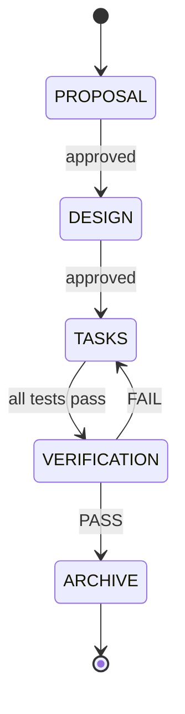

# AGENTS.md — Cursor Agent Instructions

> This file provides context, conventions, and constraints for AI coding agents
> working on this project. Read this before making any changes.

## Project Overview

**TKE RAG Chatbot** — A production-grade Retrieval-Augmented Generation chatbot
that answers questions about the Tsinghua School of Software (清华大学软件学院)
website corpus (~850 pages).

### What This System Does

1. **Crawls** the target site (`www.thss.tsinghua.edu.cn`) — all major sections
2. **Parses & chunks** article content (Chinese + English bilingual)
3. **Embeds** chunks using an OpenAI-compatible embedding API
4. **Stores** articles + chunks + vectors in PostgreSQL with pgvector
5. **Retrieves** relevant chunks via hybrid search (vector + keyword)
6. **Generates** answers with citations using an LLM
7. **Serves** a login-protected chat UI via Next.js

### Deployment Target

- Server: `123.59.90.15:8443` (HTTPS)
- Docker Compose deployment with Nginx reverse proxy
- Must be publicly accessible with login authentication

---

## Tech Stack

| Layer | Technology |
|-------|-----------|
| Framework | Next.js 15 (App Router) |
| Language | TypeScript (strict mode) |
| Database | PostgreSQL 16 + pgvector |
| ORM | TypeORM (with raw SQL for vector ops) |
| Crawler | Cheerio + node fetch |
| Embeddings | Ollama qwen3-embedding:4b (1024 dims, local) |
| LLM | OpenRouter → DeepSeek V4 Pro |
| Auth | Simple session-cookie auth (jose JWT) |
| Deployment | Docker Compose + Nginx |
| CSS | Tailwind CSS 4 |

---

## Architecture

```
User → Nginx (HTTPS :8443) → Next.js (:3000)
                                  ├── /login → session cookie
                                  ├── /chat → Chat UI (React)
                                  └── /api/chat → RAG pipeline
                                        ├── Query rewrite
                                        ├── Embedding generation
                                        ├── Hybrid retrieval (vector + keyword)
                                        ├── Chunk ranking & selection
                                        ├── LLM answer generation
                                        └── Response with citations
                                  PostgreSQL + pgvector (:5432)
```

---

## Repository Structure (Monorepo)

```
tke-rag-chatbot/
├── AGENTS.md                 # THIS FILE — agent instructions
├── README.md                 # Setup guide, architecture diagram
├── LICENSE                   # MIT
├── .env.example              # Environment variable template
├── .gitignore
├── package.json              # Root workspace config
├── tsconfig.json             # Root TS config (for scripts)
│
├── apps/
│   └── web/                  # Next.js 15 app (frontend + backend API)
│       ├── package.json
│       ├── tsconfig.json
│       ├── next.config.ts
│       ├── postcss.config.mjs
│       │
│       ├── app/              # Next.js App Router
│       │   ├── layout.tsx
│       │   ├── page.tsx      # Redirect to /login or /chat
│       │   ├── globals.css
│       │   ├── login/
│       │   │   └── page.tsx
│       │   ├── chat/
│       │   │   └── page.tsx
│       │   └── api/
│       │       ├── auth/
│       │       │   ├── login/route.ts
│       │       │   └── logout/route.ts
│       │       └── chat/
│       │           └── route.ts   # Main RAG endpoint
│       │
│       ├── components/       # React UI components
│       │   ├── chat-box.tsx
│       │   ├── chat-message.tsx
│       │   ├── citation-list.tsx
│       │   └── login-form.tsx
│       │
│       ├── lib/              # Server-side business logic
│       │   ├── db.ts         # TypeORM DataSource singleton
│       │   ├── data-source.ts # TypeORM DataSource config
│       │   ├── run-migrations.ts
│       │   ├── auth.ts       # Session management (jose JWT)
│       │   ├── embeddings.ts # OpenAI embedding client
│       │   ├── retrieval.ts  # Hybrid search (vector + keyword + RRF)
│       │   ├── chunking.ts   # Chinese-aware text chunking
│       │   ├── llm.ts        # LLM chat completion client
│       │   └── rag.ts        # RAG pipeline orchestrator
│       │
│       ├── entities/         # TypeORM entity definitions
│       │   ├── index.ts
│       │   ├── article.entity.ts
│       │   └── chunk.entity.ts
│       │
│       ├── migrations/       # TypeORM migrations (manual SQL)
│       │   └── 1700000000000-InitialSchema.ts
│       │
│       └── public/           # Static assets
│
├── docs/                     # Workflow documentation
│   ├── WORKFLOW.md           # Agentic TDD workflow reference
│   ├── decisions/            # Architectural Decision Records (ADRs)
│   │   ├── 0001-adopt-vibe-adr-and-tdd-workflow.md
│   │   ├── 0002-frontend-stack-shadcn-tanstack-tailwind.md
│   │   ├── 0003-chat-history-persistence.md
│   │   ├── 0004-rag-evaluation-question-set.md
│   │   └── 0005-i18n-strategy.md
│   ├── templates/            # Phase templates (do not edit)
│   │   ├── 01-proposal.md
│   │   ├── 02-design.md
│   │   ├── 03-tasks.md
│   │   ├── 04-verification.md
│   │   └── 05-archive.md
│   ├── active/               # Features in progress
│   └── archive/              # Completed features
│
├── scripts/                  # CLI scripts (crawl, ingest, etc.)
│   ├── crawl.ts
│   ├── ingest.ts
│   └── check-coverage.ts
│
├── docker-compose.yml
├── Dockerfile
└── nginx.conf
```

---

## Coding Conventions

### General

- **Language**: TypeScript with strict mode enabled
- **Naming**: camelCase for variables/functions, PascalCase for types/components/entities, kebab-case for file names
- **Exports**: Named exports preferred over default exports (except Next.js pages)
- **Imports**: Use `@/` path alias for `apps/web/` directory imports (within the web app)
- **Error handling**: Always handle errors explicitly. Use try/catch with typed errors. Never silently swallow errors.
- **Decorators**: TypeORM requires `experimentalDecorators` and `emitDecoratorMetadata` — these are enabled in tsconfig.

### DRY & Clean Code Policy

- **No magic strings**: Never hardcode string literals inline. Use `const enum`, `as const` objects, or typed string unions. Every string that appears more than once must be a named constant.
- **No magic numbers**: Every numeric literal with domain meaning must be a named constant or env var. `if (chunks.length > 8)` is wrong — use `if (chunks.length > FINAL_TOP_K)`.
- **Use enums / const objects for categories**: Chunk levels, message roles, section names, error codes, etc. must be defined as enums or `as const` objects with a single source of truth.
- **Centralize shared types**: Types used across modules (e.g., `Citation`, `RetrievalResult`, `ChatMessage`) live in a shared types file, not duplicated per component.
- **Configurable constants via `.env`**: Values that may need tuning (retrieval weights, top-k limits, boost factors) are read from `process.env` with typed defaults. Structural constants (RRF k=60, batch sizes) stay in code but as named exports.
- **Single source of truth**: If a value is defined in one place, every consumer imports it from there. Never redefine the same constant in two files.

```typescript
// BAD: magic strings and numbers everywhere
if (chunk.level === 1) { ... }
const results = await search(query, 8);
if (role === "assistant") { ... }

// GOOD: enums and named constants
const enum ChunkLevel { Article = 1, Section = 2 }
const FINAL_TOP_K = parseInt(process.env.RETRIEVAL_TOP_K ?? "8", 10);
const enum MessageRole { User = "user", Assistant = "assistant" }

if (chunk.level === ChunkLevel.Article) { ... }
const results = await search(query, FINAL_TOP_K);
if (role === MessageRole.Assistant) { ... }
```

### React / Next.js

- Use **App Router** (not Pages Router)
- Server Components by default; add `'use client'` only when needed
- API routes use `route.ts` with `NextRequest` / `NextResponse`
- All API routes that use TypeORM must set `export const runtime = "nodejs"`
- Keep components small and focused — one responsibility per file

### Database (TypeORM)

- Entities live in `apps/web/entities/` with `.entity.ts` suffix
- Use the singleton `getDataSource()` from `@/lib/db` in all server-side code
- **Raw SQL** (`dataSource.query()`) for all vector operations — TypeORM doesn't fully support pgvector query builders
- Use `pgvector.toSql()` for embedding parameters
- Migrations are written manually (TypeORM can't auto-generate pgvector indexes)
- Never use `synchronize: true` in production

### Crawler / Ingestion Scripts

- Scripts live in `scripts/` at the monorepo root
- They import entities and lib from `../apps/web/` using relative paths
- Run via `npx tsx scripts/<name>.ts`
- They create their own DataSource (not the Next.js singleton)
- Polite crawling: **1 request/second**, respect `robots.txt`
- User-Agent: `TKE-RAG-Challenge-Bot/1.0 AlanYiu contact:corgiking2020@gmail.com`

---

## Key Implementation Details

### Authentication

Simple demo-grade auth. Hardcoded credentials stored in `.env`:

```
AUTH_USERNAME=admin
AUTH_PASSWORD=tke2026
AUTH_SECRET=<random-32-char-string>
```

Use `HttpOnly` session cookies signed with jose (HS256 JWT). No OAuth — keep it simple.

### Crawling Strategy

Section-aware crawl, NOT random recursive crawl:

1. Start from known section list pages (新闻动态, 学生动态, 学院风采, 科研成果, 招聘信息, etc.)
2. Parse pagination (page 1 → page 2 → ... → last page)
3. Collect all article URLs from list pages
4. Fetch each article: extract title, date, section, body text, source URL
5. Also crawl static pages: 学院简介, 现任领导, 历史沿革, 师资队伍

### Chunking Strategy

Chinese-aware paragraph chunking:

- Target: 600–900 Chinese characters per chunk
- Overlap: 100–150 characters
- Split on paragraph boundaries (`\n\n`) first, then sentence boundaries (`。！？`)
- Prepend metadata to each chunk:
  ```
  标题：{title}
  日期：{date}
  栏目：{section}
  正文：
  {chunk_content}
  ```

### Retrieval Strategy

Hybrid retrieval with Reciprocal Rank Fusion (RRF):

1. Generate query embedding
2. Vector search: top 20 by cosine similarity (`<=>` operator)
3. Keyword search: top 20 by tsvector rank (pre-segmented Chinese text)
4. Merge with RRF: `score = 0.6 * 1/(k + vector_rank) + 0.4 * 1/(k + keyword_rank)` where k=60
5. Return top 5–8 chunks to LLM

### LLM System Prompt

```
You are a RAG assistant for 清华大学软件学院 / Tsinghua School of Software.

Answer only using the provided context.
If the context does not contain enough information, say you cannot find the answer in the indexed website.
Answer in the same language as the user's question unless the user asks otherwise.
Always include citations using the provided source titles and URLs.
Do not invent names, dates, awards, or article facts.
```

---

## Environment Variables

See `.env.example` for the complete list. Key variables:

| Variable | Purpose | Default |
|----------|---------|---------|
| `DATABASE_URL` | PostgreSQL connection string | — |
| `LLM_API_KEY` | OpenRouter API key (for DeepSeek chat) | — |
| `LLM_BASE_URL` | LLM API base URL | `https://openrouter.ai/api/v1` |
| `LLM_MODEL` | LLM model identifier | `deepseek/deepseek-v4-pro` |
| `OLLAMA_BASE_URL` | Ollama API base URL | `http://localhost:11434` |
| `EMBEDDING_MODEL` | Embedding model name | `qwen3-embedding:4b` |
| `EMBEDDING_DIMENSIONS` | Embedding vector dimensions | `1024` |
| `AUTH_USERNAME` | Demo login username | — |
| `AUTH_PASSWORD` | Demo login password | — |
| `AUTH_SECRET` | Session cookie signing secret | — |
| `RETRIEVAL_VECTOR_WEIGHT` | RRF vector arm weight | `0.6` |
| `RETRIEVAL_KEYWORD_WEIGHT` | RRF keyword arm weight | `0.4` |
| `RETRIEVAL_TOP_K` | Final chunks sent to LLM | `8` |
| `RETRIEVAL_L1_BOOST` | Score multiplier for L1-matched article chunks | `1.3` |

### API Provider Strategy

OpenAI and Claude APIs are **blocked from the Beijing server** (123.59.90.15).
We use two separate, China-accessible providers:

- **LLM**: OpenRouter → DeepSeek V4 Pro ($0.43/$0.87 per 1M tokens)
- **Embeddings**: Ollama → qwen3-embedding:4b (local, 1024 dimensions, 100+ languages)

**Deployment workflow**: Run embeddings locally via Ollama, `pg_dump` the database, restore on the Beijing server. The server only needs LLM API access (OpenRouter) at runtime — no Ollama needed on server.

---

## Development Workflow

```bash
# 1. Install dependencies
npm install

# 2. Start PostgreSQL with pgvector
docker compose up -d postgres

# 3. Run TypeORM migrations
npm run migration:run

# 4. Crawl the website
npm run crawl

# 5. Ingest (chunk + embed + store)
npm run ingest

# 6. Start dev server
npm run dev

# 7. Open http://localhost:3000
```

---

## Deployment Workflow

```bash
# Generate self-signed SSL cert (or use your own)
mkdir -p certs
openssl req -x509 -nodes -days 365 -newkey rsa:2048 \
  -keyout certs/server.key -out certs/server.crt \
  -subj "/CN=123.59.90.15"

# Build and deploy everything
docker compose up -d --build

# The app will be accessible at https://123.59.90.15:8443
```

---

## Architectural Decision Records (ADRs)

Significant architectural and technology decisions are recorded in `docs/decisions/`.
Agents MUST read relevant ADRs before working on related features.

| ADR | Decision | Status |
|-----|----------|--------|
| [0001](docs/decisions/0001-adopt-vibe-adr-and-tdd-workflow.md) | Adopt Vibe ADR + TDD Workflow | Accepted |
| [0002](docs/decisions/0002-frontend-stack-shadcn-tanstack-tailwind.md) | Frontend: shadcn/ui + TanStack Query + Tailwind | Accepted |
| [0003](docs/decisions/0003-chat-history-persistence.md) | Chat history: User + ChatSession + ChatMessage tables | Accepted |
| [0004](docs/decisions/0004-rag-evaluation-question-set.md) | RAG evaluation: 1000-question JSON + CLI scorer | Accepted |
| [0005](docs/decisions/0005-i18n-strategy.md) | i18n: Simple dictionary + context (zh-CN + en) | Accepted |
| [0006](docs/decisions/0006-embedding-model-and-chunking-strategy.md) | Embedding: qwen3-embedding:4b + hierarchical L1/L2 chunking | Accepted |

### When to Create a New ADR

- Choosing or changing a framework, library, or tool
- Database schema design decisions
- API design patterns
- Security architecture choices
- Deployment strategy changes
- Any decision with a blast radius > 3 files

### ADR Format

Use `docs/decisions/NNNN-short-title.md` with sections:
Context → Decision Drivers → Blast Radius → Options → Outcome → Anti-Patterns → Consequences → Confirmation

---

## Agentic TDD Workflow (MANDATORY)

**All feature work, bugfixes, and significant changes MUST follow the 5-phase
workflow documented in `docs/WORKFLOW.md`.** No phase may be skipped.

### Phases

| Phase | Name | Purpose | Deliverable |
|-------|------|---------|-------------|
| 1 | **Proposal** | Define WHAT/WHY from stakeholder perspective | `01-proposal.md` with ACs |
| 2 | **Design** | Define HOW with technical detail | `02-design.md` with diagrams, data spec |
| 3 | **Tasks** | TDD implementation (Red-Green-Refactor) | `03-tasks.md` + code + tests |
| 4 | **Verification** | Verify all ACs pass | `04-verification.md` with evidence |
| 5 | **Archive** | Close out, document lessons | `05-archive.md`, move to `docs/archive/` |

### Key Rules

1. **Read `docs/WORKFLOW.md`** before starting any feature work
2. **Follow TDD strictly**: Write the failing test FIRST, then implement, then refactor
3. **Never skip phases**: Proposal → Design → Tasks → Verification → Archive
4. **Active work** lives in `docs/active/FEAT-XXX-name/`
5. **Completed work** moves to `docs/archive/FEAT-XXX-name/`
6. **Templates** are in `docs/templates/` — copy them, don't edit originals
7. **Every AC must be testable** — write it in Given/When/Then format
8. **Get user approval** at phase gates (end of Phase 1 and Phase 2)

### Quick Start for Agents

```bash
# Starting a new feature
mkdir docs/active/FEAT-XXX-short-name
cp docs/templates/01-proposal.md docs/active/FEAT-XXX-short-name/
# Fill in proposal, present to user for approval
# Then proceed through phases 2-5 in order
```

### Workflow State Machine



---

## Do's and Don'ts for Agents

### DO

- Read this file before making changes
- Follow the file naming conventions (kebab-case for files, PascalCase for entities)
- Use `getDataSource()` singleton in Next.js server code
- Use raw SQL with `pgvector.toSql()` for vector operations
- Handle errors with try/catch
- Add proper TypeScript types — no `any`
- Keep the crawler polite (1 req/sec)
- Write TypeORM migrations manually for pgvector indexes
- Prepend metadata to chunks for better retrieval
- Import `reflect-metadata` before TypeORM entities in scripts

### DON'T

- Don't use LangChain — write the RAG pipeline directly
- Don't use Pages Router — use App Router only
- Don't use Prisma — this project uses TypeORM
- Don't commit `.env` files or secrets
- Don't use `any` type — define proper interfaces
- Don't use `synchronize: true` — always use migrations
- Don't do recursive full-site crawl without section awareness
- Don't skip error handling in API routes
- Don't use client components unnecessarily
- Don't chunk Chinese text by word count alone (use character-aware chunking)
- Don't rely on pure vector search — always use hybrid retrieval
- Don't use Edge Runtime — TypeORM requires Node.js runtime

---

## Evaluation Criteria Reminder

| Criteria | Weight | Focus |
|----------|--------|-------|
| Correctness | 40% | Accurate answers from the evaluation question set |
| Code Quality | 30% | Clean architecture, error handling, documentation |
| System Design | 20% | Scalability, modularity, chunking/embedding strategy |
| UX & Deployment | 10% | Chat UI usability, deployment robustness, auth |
