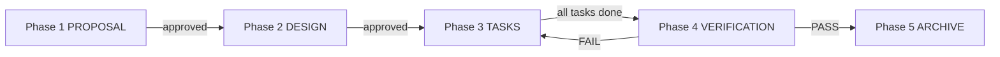
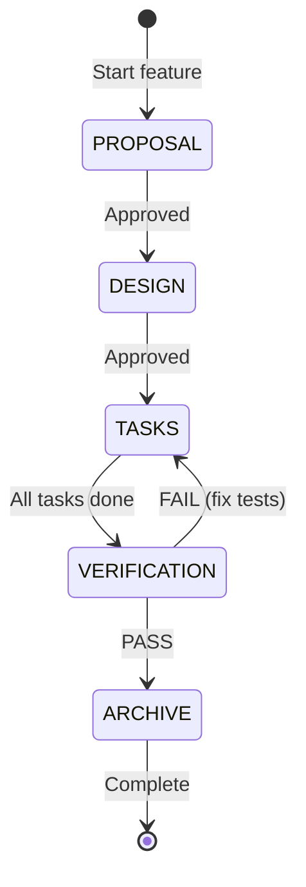

# Agentic TDD Workflow

> Every feature, bugfix, or significant change follows this 5-phase workflow.
> Agents MUST follow these phases in order. No phase may be skipped.

---

## Overview



---

## Directory Structure

```
docs/
├── WORKFLOW.md          # THIS FILE — workflow reference
├── templates/           # Phase templates (do not edit directly)
│   ├── 01-proposal.md
│   ├── 02-design.md
│   ├── 03-tasks.md
│   ├── 04-verification.md
│   └── 05-archive.md
├── active/              # Features currently in progress
│   └── FEAT-001-feature-name/
│       ├── 01-proposal.md
│       ├── 02-design.md
│       ├── 03-tasks.md
│       └── 04-verification.md
└── archive/             # Completed features
    └── FEAT-001-feature-name/
        ├── 01-proposal.md
        ├── 02-design.md
        ├── 03-tasks.md
        ├── 04-verification.md
        └── 05-archive.md
```

---

## Phase 1: Proposal

**Purpose**: Define WHAT and WHY from a stakeholder perspective before touching code.

**Deliverable**: `docs/active/FEAT-XXX-name/01-proposal.md`

### Agent Instructions

1. Create a new folder under `docs/active/` named `FEAT-XXX-short-name`
2. Copy `docs/templates/01-proposal.md` into the folder
3. Fill in ALL sections:
   - Problem statement (one paragraph)
   - Business requirements with MoSCoW priority
   - Stakeholder analysis (user, evaluator, developer, ops)
   - User stories in `As a / I want / So that` format
   - **Acceptance Criteria** in Given/When/Then format — every AC must be testable
   - Out of scope, risks, success metrics
4. Present to the user for review before proceeding

### Gate Criteria

- [ ] All ACs are written in Given/When/Then format
- [ ] Each AC has a defined test type (Unit / Integration / E2E)
- [ ] Stakeholders and risks are identified
- [ ] User has approved the proposal

---

## Phase 2: Design

**Purpose**: Define HOW with enough technical detail that implementation is mechanical.

**Deliverable**: `docs/active/FEAT-XXX-name/02-design.md`

### Agent Instructions

1. Copy `docs/templates/02-design.md` into the feature folder
2. Fill in ALL sections:
   - Architecture diagrams (system context, component, sequence)
   - Data specification (entities, schema changes, migrations)
   - API contracts (request/response/errors)
   - File change manifest
   - **Testing strategy** — map every AC to a test file and test type
   - Performance, security, rollback considerations
3. Present to the user for review before proceeding

### Gate Criteria

- [ ] Every AC from Phase 1 has a corresponding test in the test plan
- [ ] Data schema and API contracts are fully specified
- [ ] File change list is complete
- [ ] User has approved the design

---

## Phase 3: Tasks (TDD Implementation)

**Purpose**: Execute implementation using strict Test-Driven Development.

**Deliverable**: `docs/active/FEAT-XXX-name/03-tasks.md` + working code + passing tests

### Agent Instructions

1. Copy `docs/templates/03-tasks.md` into the feature folder
2. Break the design into ordered tasks, each following TDD:
   - **T-even**: Write failing test (RED)
   - **T-odd**: Write implementation to pass test (GREEN)
   - After a set of related tasks: REFACTOR
3. Execute tasks in order:
   ```
   For each AC:
     a. Write the test FIRST — run it, confirm it FAILS
     b. Write the minimum implementation — run the test, confirm it PASSES
     c. Refactor if needed — run all tests, confirm they still PASS
   ```
4. Update the progress tracker in `03-tasks.md` as you go
5. Use the TodoWrite tool to track progress in real time

### TDD Rules (Non-Negotiable)

- **Never write implementation code without a failing test first**
- **Never move to the next AC until current AC's tests pass**
- **Run the full test suite after each refactor step**
- **Commit test and implementation together** (test proves the implementation)

### Gate Criteria

- [ ] All tasks completed
- [ ] All tests pass
- [ ] Code follows project conventions (see AGENTS.md)
- [ ] Ready for verification

---

## Phase 4: Verification

**Purpose**: Formally verify all ACs pass. Catch regressions. Document evidence.

**Deliverable**: `docs/active/FEAT-XXX-name/04-verification.md`

### Agent Instructions

1. Copy `docs/templates/04-verification.md` into the feature folder
2. Run ALL test suites:
   ```bash
   # Unit tests
   npm test

   # Type check
   npx tsc --noEmit

   # Build check
   npm run build
   ```
3. Fill in the AC verification matrix — every AC must show PASS with evidence
4. Generate and record test coverage
5. Run manual verification checklist
6. Run regression check (existing tests still pass)
7. Document any issues found and their resolution

### Gate Criteria

- [ ] All ACs verified PASS
- [ ] Test coverage >= 60% for new code (enforced by vitest threshold)
- [ ] No TypeScript errors
- [ ] Build succeeds
- [ ] No regressions in existing tests
- [ ] Overall status is PASS

---

## Phase 5: Archive

**Purpose**: Close out the feature. Document decisions and lessons learned.

**Deliverable**: `docs/archive/FEAT-XXX-name/05-archive.md`

### Agent Instructions

1. Copy `docs/templates/05-archive.md` into the feature folder
2. Fill in:
   - Summary of what was delivered
   - Links to all phase documents
   - AC results summary
   - Key decisions and rationale
   - Lessons learned
   - Files changed and related commits
3. Move the entire feature folder from `docs/active/` to `docs/archive/`
4. Update AGENTS.md if any conventions changed

### Gate Criteria

- [ ] All phases documented
- [ ] Feature folder moved to `docs/archive/`
- [ ] No open issues remaining

---

## Quick Reference: Starting a New Feature

```bash
# 1. Create feature folder
mkdir docs/active/FEAT-XXX-short-name

# 2. Copy phase 1 template
cp docs/templates/01-proposal.md docs/active/FEAT-XXX-short-name/

# 3. Fill in proposal, get approval, then copy next template
cp docs/templates/02-design.md docs/active/FEAT-XXX-short-name/

# 4. Continue through phases...
```

## Feature ID Convention

- Format: `FEAT-XXX` where XXX is a zero-padded sequential number
- Examples: `FEAT-001`, `FEAT-002`, `FEAT-042`
- Use kebab-case for the folder suffix: `FEAT-001-hybrid-search-improvement`

---

## Workflow State Machine



If verification fails, return to Phase 3 to fix failing tests, then re-verify.
