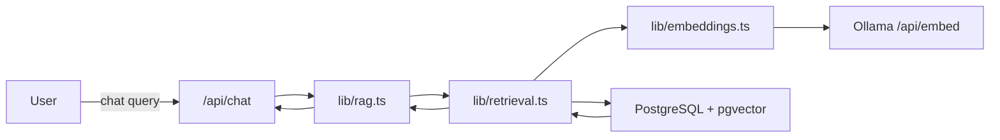
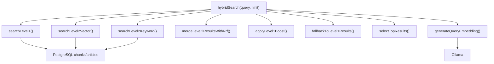
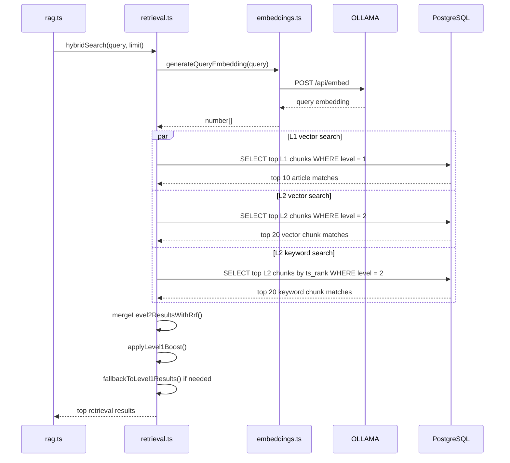
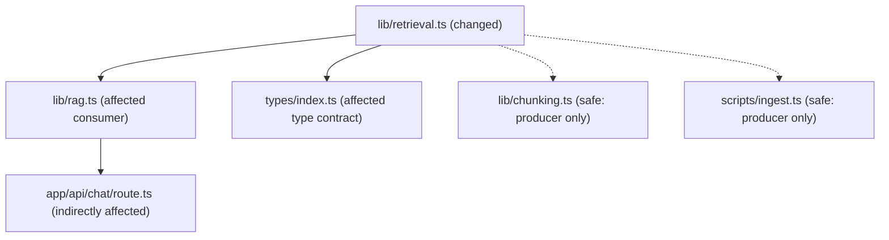

# Phase 2: Technical Design — Two-Level Hybrid Retrieval (Vector + Keyword + RRF)

> **Status**: DESIGN
> **Proposal**: [01-proposal.md](./01-proposal.md)
> **Author**: Agent
> **Date**: 2026-06-24
> **Feature ID**: FEAT-003
> **Related ADR**: [ADR-0006](../../decisions/0006-embedding-model-and-chunking-strategy.md)

---

## 1. Architecture Overview

This feature rewrites the retrieval layer to match the hierarchical chunking introduced in FEAT-002. The new flow performs three searches per query: Level 1 vector search across article chunks, Level 2 vector search across section chunks, and Level 2 keyword search across jieba-segmented text. The retrieval service then fuses Level 2 results with Reciprocal Rank Fusion (RRF), boosts Level 2 chunks whose parent article matched strongly at Level 1, falls back to L1-only results when no L2 chunks exist, and returns a small citation-ready result set for the RAG pipeline.

### System Context Diagram



### Component Diagram



## 2. Data Specification

### Existing Data Model Used

No schema changes are required. Retrieval reads from the existing `chunks` and `articles` tables populated in FEAT-002.

```typescript
interface RetrievalResult {
  chunkId: number;
  articleId: number;
  content: string;
  score: number;
  title: string;
  url: string;
  section: string | null;
  publishedDate: Date | null;
  level?: ChunkLevel;
}

interface Level1Match {
  articleId: number;
  rank: number;
}

interface RankedChunkMatch {
  chunkId: number;
  articleId: number;
  content: string;
  title: string;
  url: string;
  section: string | null;
  publishedDate: Date | null;
  level: ChunkLevel;
  vectorRank?: number;
  keywordRank?: number;
}
```

### Database Migration

No migration in FEAT-003.

### API Contracts

No public API shape changes are required in this phase. `rag.ts` continues to call `hybridSearch(query)` and receives `RetrievalResult[]`.

## 3. Sequence Diagram



## 4. File Changes

| File | Action | Description |
|------|--------|-------------|
| `apps/web/lib/retrieval.ts` | MODIFY | Rewrite from flat single-level retrieval to two-level retrieval pipeline |
| `apps/web/lib/__tests__/retrieval.test.ts` | CREATE | Unit tests for L1 search, L2 search, RRF merge, boost, fallback, output shape |
| `apps/web/types/index.ts` | MODIFY | Extend `RetrievalResult` with `level` for citation-aware retrieval results |
| `docs/active/FEAT-003-hybrid-retrieval/02-design.md` | CREATE | Phase 2 design doc |

## 5. Dependencies

### Internal Dependencies

- `apps/web/lib/db.ts`: provides the singleton DataSource
- `apps/web/lib/embeddings.ts`: generates the query embedding via Ollama
- `apps/web/lib/constants.ts`: shared retrieval weights and structural constants
- `apps/web/types/index.ts`: `RetrievalResult` shared with `rag.ts`
- `apps/web/lib/rag.ts`: downstream consumer of `hybridSearch()`

### External Dependencies (new packages)

No new packages required.

## 6. Testing Strategy (TDD)

Tests are written BEFORE implementation. Follow Red-Green-Refactor.

### Test Plan

| AC ID | Test File | Test Description | Type |
|-------|-----------|------------------|------|
| AC-1 | `apps/web/lib/__tests__/retrieval.test.ts` | `searchLevel1()` emits a level-filtered L1 vector query and returns top 10 article matches | Unit |
| AC-2 | `apps/web/lib/__tests__/retrieval.test.ts` | `searchLevel2Vector()` emits a level-filtered L2 vector query and returns top 20 section matches | Unit |
| AC-3 | `apps/web/lib/__tests__/retrieval.test.ts` | `searchLevel2Keyword()` emits a level-filtered keyword query using `content_segmented` | Unit |
| AC-4 | `apps/web/lib/__tests__/retrieval.test.ts` | RRF merge computes `VECTOR_WEIGHT/(RRF_K+rankV) + KEYWORD_WEIGHT/(RRF_K+rankK)` correctly | Unit |
| AC-5 | `apps/web/lib/__tests__/retrieval.test.ts` | L1 boost applies only when the parent `articleId` appears in Level 1 top matches | Unit |
| AC-6 | `apps/web/lib/__tests__/retrieval.test.ts` | Final selection dedupes by `chunkId` and respects the requested limit | Unit |
| AC-7 | `apps/web/lib/__tests__/retrieval.test.ts` | Returned result includes title, URL, section, date, content, score, and level | Unit |
| AC-8 | `apps/web/lib/__tests__/retrieval.test.ts` | A chunk present in both L2 arms gets a larger combined score than a chunk from one arm only | Unit |
| AC-9 | `apps/web/lib/__tests__/retrieval.test.ts` | Empty DB / empty search results return `[]` without throwing | Unit |
| AC-10 | `apps/web/lib/__tests__/retrieval.test.ts` | English query still passes through embedding + retrieval orchestration and returns mocked Chinese chunk data | Integration-lite |

### Test Infrastructure Needed

- [x] Vitest already configured from FEAT-002
- [ ] Mock `getDataSource()` and capture raw SQL plus parameters
- [ ] Mock `generateQueryEmbedding()` to avoid live Ollama calls in retrieval tests
- [ ] Reusable fixtures for L1 matches, L2 vector matches, and L2 keyword matches

## 7. Blast Radius Analysis

This is a contained service-layer rewrite, but it affects the quality and shape of every answer generated by the chatbot.

### Dependency Graph



### Migration Safety

- **Backward compatible?** Yes at the schema level
- **Downtime required?** None
- **Data re-processing needed?** None, assuming FEAT-002 ingestion has completed

## 8. Anti-Patterns & Guardrails

| Anti-Pattern | Detection Method | Guardrail |
|-------------|-----------------|-----------|
| Leaving `retrieval.ts` as one big raw SQL string | Code review | Split logic into small functions: L1 search, L2 search, merge, boost, fallback |
| Ignoring `level` filters in SQL | Unit tests inspect emitted SQL | Explicit `WHERE c.level = $N` in every arm |
| Recomputing constants inline | Lint/code review | Import all weights and top-k constants from `constants.ts` |
| Returning L1 chunks alongside L2 chunks in the normal path | Unit tests | L1 is a boost signal first, fallback result source second |
| Duplicate chunk results after merge | Unit tests | Merge by `chunkId`, not by row order |
| Overly broad fallback | Unit tests | Use L1 fallback only when merged L2 results are empty |

## 9. Security Design

### Input Validation

| Input | Validation | Sanitization |
|-------|-----------|-------------|
| `query` | Non-empty string; caller-level length limits remain in chat route | Pass as SQL parameter only |
| `embedding` | Array from trusted embedding client | Convert with `pgvector.toSql()` |
| `limit` | Default from `FINAL_TOP_K`; bounded by caller | Pass as numeric SQL parameter |

### Data Protection

- **Secrets handling**: Retrieval itself holds no secrets; embedding credentials remain local Ollama config only.
- **Data exposure**: Retrieval returns only article metadata and chunk text already intended for RAG use.
- **Injection prevention**: All SQL remains parameterized. No string interpolation for user query text.

## 10. Performance Considerations

- Each query performs three bounded searches: `L1_TOP_K = 10`, `L2_VECTOR_TOP_K = 20`, and `L2_KEYWORD_TOP_K = 20`.
- HNSW and GIN indexes keep each arm bounded and selective.
- The rewrite should prefer multiple small, predictable raw SQL queries over one opaque mega-query because that is easier to test and tune.
- Fallback to L1-only results avoids returning nothing for short-article-only matches.
- Result formatting should remain lightweight; heavy reranking is explicitly out of scope.

## 11. Rollback Plan

If FEAT-003 retrieval quality regresses:

1. Revert `apps/web/lib/retrieval.ts` to the prior single-level implementation.
2. Revert the `RetrievalResult` type extension if added.
3. Re-run unit tests and a small manual chat smoke test.
4. Keep FEAT-002 chunk data intact; rollback is code-only.

---

## Sign-off

- [x] Architecture reviewed
- [x] Data spec agreed
- [x] Test plan covers all ACs
- [ ] Ready for Phase 3 (Tasks)
