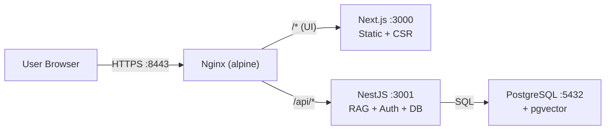
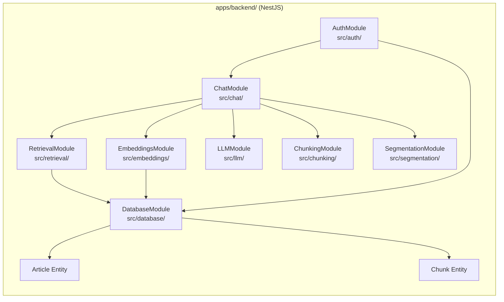
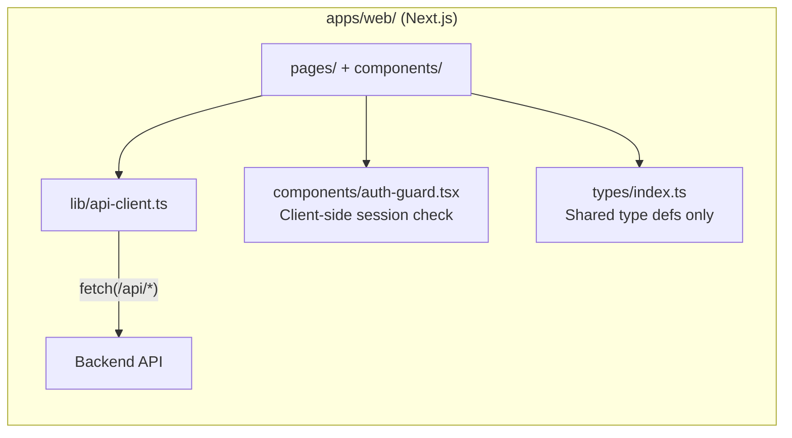
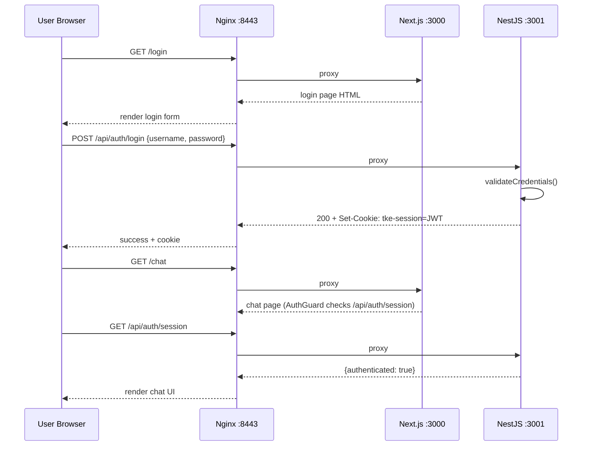
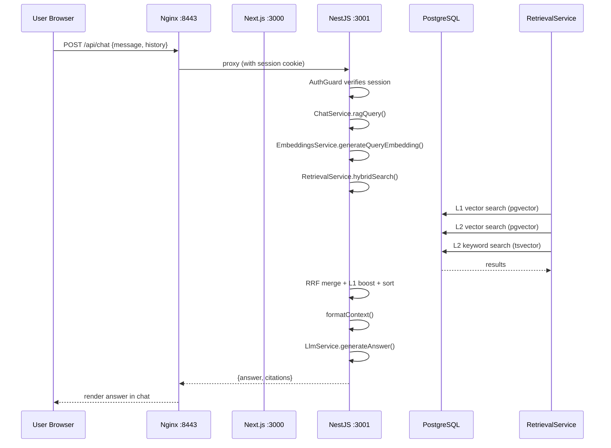
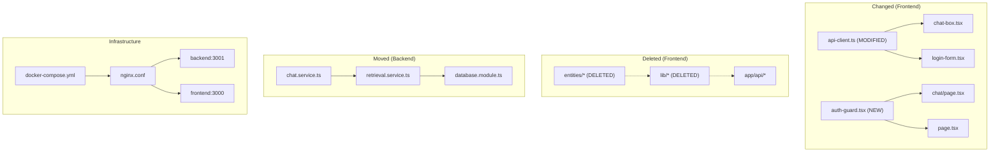

# Phase 2: Technical Design — Extract Backend to NestJS

> **Status**: DESIGN
> **Proposal**: [01-proposal.md](./01-proposal.md)
> **Author**: Alan Yiu
> **Date**: 2026-06-24
> **Feature ID**: FEAT-007

---

## 1. Architecture Overview

The monolith at `apps/web/` is split into two independent apps:

- **`apps/backend/`** — NestJS 11 application (port 3001). Owns all server-side logic.
- **`apps/web/`** — Next.js 15 application (port 3000). Pure frontend. No server deps.

Nginx acts as the single entry point, routing by path prefix.

### System Context Diagram



### Component Diagram — NestJS Backend



### Component Diagram — Next.js Frontend (After Extraction)



---

## 2. Data Specification

### Entities — Moved to `apps/backend/src/entities/`

No schema changes. Same entities, same migrations. Just moved.

```typescript
// apps/backend/src/entities/article.entity.ts
@Entity("articles")
export class Article {
  @PrimaryGeneratedColumn()
  id!: number;

  @Index({ unique: true })
  @Column("text")
  url!: string;

  @Column("text")
  title!: string;

  @Column({ type: "text", nullable: true })
  section!: string | null;

  @Column({ name: "published_date", type: "date", nullable: true })
  publishedDate!: Date | null;

  @Column({ type: "text", nullable: true })
  summary!: string | null;

  @Column("text")
  body!: string;

  @Column({ name: "image_urls", type: "jsonb", default: "[]" })
  imageUrls!: string[];

  @CreateDateColumn({ name: "created_at" })
  createdAt!: Date;

  @OneToMany(() => Chunk, (chunk) => chunk.article)
  chunks!: Chunk[];
}
```

```typescript
// apps/backend/src/entities/chunk.entity.ts
@Entity("chunks")
export class Chunk {
  @PrimaryGeneratedColumn()
  id!: number;

  @Column({ name: "article_id" })
  articleId!: number;

  @Column({ name: "chunk_index" })
  chunkIndex!: number;

  @Column({ type: "smallint", default: ChunkLevel.Article })
  level!: ChunkLevel;

  @Column("text")
  content!: string;

  @Column({ name: "content_segmented", type: "text", nullable: true })
  contentSegmented!: string | null;

  @Column({ type: "vector", nullable: true })
  embedding!: number[] | null;

  @Column({ name: "token_count", nullable: true })
  tokenCount!: number | null;

  @CreateDateColumn({ name: "created_at" })
  createdAt!: Date;

  @ManyToOne(() => Article, (article) => article.chunks, { onDelete: "CASCADE" })
  @JoinColumn({ name: "article_id" })
  article!: Article;
}
```

### Migrations — Moved to `apps/backend/src/migrations/`

All 4 existing migration files moved verbatim. No new migrations.

### Migration Safety

- **Backward compatible?** Yes — same database, same schema, same connection string.
- **Downtime required?** Brief (seconds) — during Docker Compose service swap.
- **Data re-processing needed?** None — data is preserved in PostgreSQL.

---

## 3. API Contracts

All endpoints served from NestJS, proxied through nginx at `https://host:8443/api/*`.

### 3.1 `POST /api/auth/login`

**Request:**
```json
{
  "username": "string — admin username",
  "password": "string — admin password"
}
```

**Response (200):**
```json
{
  "success": true
}
```
Also sets `Set-Cookie: tke-session=<JWT>; HttpOnly; Secure; SameSite=Lax; Path=/; Max-Age=86400`

**Response (400):**
```json
{
  "statusCode": 400,
  "message": ["username must be a string", "password must be a string"]
}
```

**Response (401):**
```json
{
  "statusCode": 401,
  "message": "Invalid credentials"
}
```

### 3.2 `POST /api/auth/logout`

**Request:** No body. Session cookie in request.

**Response (200):**
```json
{
  "success": true
}
```
Clears `tke-session` cookie.

**Response (401):**
```json
{
  "statusCode": 401,
  "message": "No valid session"
}
```

### 3.3 `GET /api/auth/session`

**Request:** No body. Session cookie in request.

**Response (200 — authenticated):**
```json
{
  "authenticated": true,
  "username": "admin"
}
```

**Response (200 — not authenticated):**
```json
{
  "authenticated": false,
  "username": null
}
```
Returns 200 regardless; frontend checks `authenticated` field. No 401 — this endpoint is called to determine auth state.

### 3.4 `POST /api/chat`

**Request:**
```json
{
  "message": "string — user's question",
  "history": [
    {
      "role": "user",
      "content": "previous question"
    },
    {
      "role": "assistant",
      "content": "previous answer"
    }
  ]
}
```

**Response (200):**
```json
{
  "answer": "string — LLM-generated answer with inline citations",
  "citations": [
    {
      "title": "string — article title",
      "url": "string — source URL",
      "section": "string | null — article section",
      "date": "string | null — published date"
    }
  ]
}
```

**Response (400):**
```json
{
  "statusCode": 400,
  "message": ["message must be a non-empty string"]
}
```

**Response (401):**
```json
{
  "statusCode": 401,
  "message": "Authentication required"
}
```

### 3.5 `GET /api/docs` (Swagger)

Returns Swagger UI HTML page (served by `@nestjs/swagger`). Rendered at this URL; all endpoints documented.

---

## 4. NestJS Module Structure

```
apps/backend/
├── package.json
├── tsconfig.json
├── nest-cli.json
├── Dockerfile
│
├── src/
│   ├── main.ts                          # Bootstrap: ValidationPipe, CORS, Swagger, cookie-parser
│   ├── app.module.ts                    # Root module: imports all feature modules
│   │
│   ├── database/
│   │   ├── database.module.ts           # TypeOrmModule.forRootAsync()
│   │   ├── data-source.ts              # CLI DataSource (for migrations)
│   │   └── run-migrations.ts           # Migration runner entry
│   │
│   ├── entities/
│   │   ├── index.ts                     # Barrel export
│   │   ├── article.entity.ts
│   │   └── chunk.entity.ts
│   │
│   ├── migrations/
│   │   ├── 1700000000000-InitialSchema.ts
│   │   ├── 1700000000001-AddImageUrls.ts
│   │   ├── 1700000000002-AddChunkLevel.ts
│   │   └── 1782232924454-Migration.ts
│   │
│   ├── auth/
│   │   ├── auth.module.ts               # Imports JwtModule; provides AuthService + AuthController
│   │   ├── auth.controller.ts           # POST /login, POST /logout, GET /session
│   │   ├── auth.service.ts              # validateCredentials(), createSession(), verifySession()
│   │   ├── auth.guard.ts                # @UseGuards(AuthGuard) for protected routes
│   │   ├── auth.constants.ts            # COOKIE_NAME, SESSION_TTL, etc.
│   │   └── dto/
│   │       ├── login.dto.ts             # class-validator DTO
│   │       └── session-response.dto.ts
│   │
│   ├── chat/
│   │   ├── chat.module.ts               # Imports RetrievalModule, EmbeddingsModule, LLMModule, ChunkingModule
│   │   ├── chat.controller.ts           # POST /chat (guarded)
│   │   ├── chat.service.ts              # ragQuery(): orchestrates retrieval → context → LLM
│   │   ├── chat.constants.ts            # FINAL_TOP_K, system prompt
│   │   └── dto/
│   │       ├── chat-request.dto.ts
│   │       └── chat-response.dto.ts
│   │
│   ├── retrieval/
│   │   ├── retrieval.module.ts
│   │   ├── retrieval.service.ts         # hybridSearch(query), formatContext(results)
│   │   └── retrieval.constants.ts       # RRF_K, weights, L1_BOOST, TOP_K values
│   │
│   ├── embeddings/
│   │   ├── embeddings.module.ts
│   │   ├── embeddings.service.ts        # generateQueryEmbedding(), generateEmbeddings()
│   │   └── embeddings.constants.ts      # MODEL, DIMS, BASE_URL, BATCH_SIZE
│   │
│   ├── llm/
│   │   ├── llm.module.ts
│   │   ├── llm.service.ts               # generateAnswer(), generateAnswerStream()
│   │   └── llm.constants.ts             # MODEL, BASE_URL, TEMPERATURE, MAX_TOKENS
│   │
│   ├── chunking/
│   │   ├── chunking.module.ts
│   │   ├── chunking.service.ts          # chunkArticle()
│   │   └── chunking.constants.ts
│   │
│   ├── segmentation/
│   │   ├── segmentation.module.ts
│   │   ├── segmentation.service.ts      # segmentText()
│   │   └── segmentation.constants.ts
│   │
│   ├── common/
│   │   ├── common.module.ts
│   │   ├── date-utils.ts                # normalizePublishedDate()
│   │   ├── server-env.ts                # ensureServerEnv() — loads .env from monorepo root
│   │   └── constants.ts                 # Shared enums: ChunkLevel, MessageRole
│   │
│   └── types/
│       └── index.ts                     # ChatMessage, Citation, RetrievalResult, etc.
│
├── scripts/
│   ├── crawl.ts                         # Web crawler (moved from root scripts/)
│   ├── ingest.ts                        # Chunk + embed + store (moved from root scripts/)
│   └── check-coverage.ts                # Coverage checker (moved from root scripts/)
│
└── __tests__/
    ├── auth/
    ├── chat/
    ├── retrieval/
    ├── embeddings/
    └── llm/
```

---

## 5. Next.js Frontend After Extraction

```
apps/web/
├── package.json                         # NO: typeorm, pg, pgvector, jose, openai, nodejieba, reflect-metadata
├── tsconfig.json
├── next.config.ts                       # NO: serverExternalPackages, NO: output:"standalone"
├── app/
│   ├── layout.tsx
│   ├── globals.css
│   ├── page.tsx                         # Client-side: check session → redirect /chat or /login
│   ├── login/
│   │   └── page.tsx                     # Client component only
│   ├── chat/
│   │   └── page.tsx                     # Wrapped in <AuthGuard>
│   └── api/                             # DELETED — entire directory removed
├── components/
│   ├── auth-guard.tsx                   # NEW — client-side auth wrapper
│   ├── chat-box.tsx                     # Modified — updated API calls
│   ├── chat-message.tsx                 # Unchanged
│   ├── citation-list.tsx                # Unchanged
│   └── login-form.tsx                   # Modified — updated API calls
├── lib/
│   └── api-client.ts                    # Only remaining lib file — modified for new API contract
├── types/
│   └── index.ts                         # Frontend-only type definitions (no entity imports)
└── public/                              # Unchanged
```

### New Component: `auth-guard.tsx`

```typescript
"use client";

// Renders children only if GET /api/auth/session returns authenticated=true
// Shows loading skeleton while checking, redirects to /login if unauthenticated

export function AuthGuard({ children }: { children: React.ReactNode }) {
  // useEffect → fetch /api/auth/session
  //   authenticated=true  → render children
  //   authenticated=false → router.push("/login")
  //   loading             → render <Skeleton />
}
```

---

## 6. Sequence Diagrams

### Authentication Flow



### Chat Query Flow



---

## 7. File Change Manifest

| File | Action | Description |
|------|--------|-------------|
| **Backend (new)** | | |
| `apps/backend/package.json` | CREATE | NestJS deps: @nestjs/core, @nestjs/typeorm, typeorm, pg, pgvector, @nestjs/jwt, jose, openai, nodejieba, @nestjs/swagger, @nestjs/throttler, class-validator, class-transformer, dotenv, reflect-metadata, cookie-parser |
| `apps/backend/tsconfig.json` | CREATE | NestJS standard tsconfig with strict mode |
| `apps/backend/nest-cli.json` | CREATE | NestJS CLI config |
| `apps/backend/Dockerfile` | CREATE | Multi-stage Dockerfile for NestJS |
| `apps/backend/src/main.ts` | CREATE | Bootstrap with ValidationPipe, CORS, Swagger, cookie-parser |
| `apps/backend/src/app.module.ts` | CREATE | Root NestJS module |
| `apps/backend/src/database/database.module.ts` | CREATE | TypeOrmModule.forRootAsync() |
| `apps/backend/src/database/data-source.ts` | CREATE | CLI DataSource for migrations |
| `apps/backend/src/database/run-migrations.ts` | CREATE | Migration runner script |
| `apps/backend/src/entities/*.ts` | MOVE | From `apps/web/entities/` |
| `apps/backend/src/migrations/*.ts` | MOVE | From `apps/web/migrations/` |
| `apps/backend/src/auth/*.ts` | CREATE | Auth module, controller, service, guard, DTOs |
| `apps/backend/src/chat/*.ts` | CREATE | Chat controller + service (ragQuery orchestrator) |
| `apps/backend/src/retrieval/*.ts` | MOVE+ADAPT | From `apps/web/lib/retrieval.ts` → NestJS service |
| `apps/backend/src/embeddings/*.ts` | MOVE+ADAPT | From `apps/web/lib/embeddings.ts` → NestJS service |
| `apps/backend/src/llm/*.ts` | MOVE+ADAPT | From `apps/web/lib/llm.ts` → NestJS service |
| `apps/backend/src/chunking/*.ts` | MOVE+ADAPT | From `apps/web/lib/chunking.ts` → NestJS service |
| `apps/backend/src/segmentation/*.ts` | MOVE+ADAPT | From `apps/web/lib/segmentation.ts` → NestJS service |
| `apps/backend/src/common/*.ts` | MOVE+ADAPT | From `apps/web/lib/constants.ts`, `date-utils.ts`, `server-env.ts` |
| `apps/backend/src/types/index.ts` | MOVE | From `apps/web/types/index.ts` |
| `apps/backend/scripts/*.ts` | MOVE | From `scripts/` at monorepo root |
| `apps/backend/__tests__/**` | MOVE+ADAPT | All existing tests migrated to NestJS test format |
| **Frontend (modified)** | | |
| `apps/web/package.json` | MODIFY | Remove server deps; keep react, next, tailwind, tanstack, zod, react-hook-form, react-markdown |
| `apps/web/next.config.ts` | MODIFY | Remove `serverExternalPackages`, remove `output: "standalone"` |
| `apps/web/app/api/**` | DELETE | Entire directory |
| `apps/web/lib/auth.ts` | DELETE | Moved to backend |
| `apps/web/lib/db.ts` | DELETE | Moved to backend |
| `apps/web/lib/data-source.ts` | DELETE | Moved to backend |
| `apps/web/lib/rag.ts` | DELETE | Moved to backend |
| `apps/web/lib/retrieval.ts` | DELETE | Moved to backend |
| `apps/web/lib/embeddings.ts` | DELETE | Moved to backend |
| `apps/web/lib/llm.ts` | DELETE | Moved to backend |
| `apps/web/lib/chunking.ts` | DELETE | Moved to backend |
| `apps/web/lib/segmentation.ts` | DELETE | Moved to backend |
| `apps/web/lib/constants.ts` | DELETE | Moved to backend |
| `apps/web/lib/date-utils.ts` | DELETE | Moved to backend |
| `apps/web/lib/server-env.ts` | DELETE | Moved to backend |
| `apps/web/lib/run-migrations.ts` | DELETE | Moved to backend |
| `apps/web/lib/api-client.ts` | MODIFY | Updated for new API contract |
| `apps/web/entities/**` | DELETE | Moved to backend |
| `apps/web/migrations/**` | DELETE | Moved to backend |
| `apps/web/types/index.ts` | MODIFY | Remove entity imports; keep frontend-facing types only |
| `apps/web/app/page.tsx` | MODIFY | Remove server-side session check; add client-side redirect |
| `apps/web/app/chat/page.tsx` | MODIFY | Wrap in AuthGuard; remove server-side session check |
| `apps/web/app/login/page.tsx` | MODIFY | Remove server-side session check |
| `apps/web/components/auth-guard.tsx` | CREATE | Client-side auth wrapper component |
| `apps/web/components/chat-box.tsx` | MODIFY | Update API call signatures |
| `apps/web/components/login-form.tsx` | MODIFY | Update API call signatures |
| **Infrastructure (modified)** | | |
| `docker-compose.yml` | MODIFY | Replace `app` with `backend` + `frontend`; add nginx depends_on |
| `Dockerfile` | DELETE | Replaced by two new Dockerfiles |
| `Dockerfile.backend` | CREATE | Multi-stage NestJS Dockerfile |
| `Dockerfile.frontend` | CREATE | Multi-stage Next.js Dockerfile |
| `nginx.conf` | MODIFY | Add `/api/*` → backend:3001; `/*` → frontend:3000; remove WebSocket upgrade |
| **Root (modified)** | | |
| `package.json` | MODIFY | Update scripts for dual-app workspace |
| **Root (deleted)** | | |
| `scripts/` | DELETE | Moved to `apps/backend/scripts/` |

---

## 8. Dependencies

### NestJS Backend Dependencies

| Package | Version | Purpose | Size Impact |
|---------|---------|---------|-------------|
| `@nestjs/core` | ^11.0 | NestJS framework core | ~2MB |
| `@nestjs/common` | ^11.0 | NestJS common decorators/utils | ~1MB |
| `@nestjs/platform-express` | ^11.0 | HTTP server adapter | ~500KB |
| `@nestjs/typeorm` | ^11.0 | TypeORM integration module | ~50KB |
| `@nestjs/jwt` | ^11.0 | JWT utilities for auth | ~30KB |
| `@nestjs/swagger` | ^11.0 | OpenAPI/Swagger generation | ~200KB |
| `@nestjs/throttler` | ^6.0 | Rate limiting | ~40KB |
| `typeorm` | ^0.3.20 | ORM (same as current) | Existing |
| `pg` | ^8.13.0 | PostgreSQL driver (same as current) | Existing |
| `pgvector` | ^0.2.0 | pgvector utils (same as current) | Existing |
| `reflect-metadata` | ^0.2.0 | Decorator metadata (same as current) | Existing |
| `jose` | ^6.0.0 | JWT sign/verify (same as current) | Existing |
| `openai` | ^4.77.0 | LLM client (same as current) | Existing |
| `nodejieba` | ^2.6.0 | Chinese segmentation (same as current) | Existing |
| `dotenv` | ^17.0.0 | Env file loading (same as current) | Existing |
| `class-validator` | ^0.14.0 | DTO validation | ~400KB |
| `class-transformer` | ^0.5.0 | DTO transformation | ~100KB |
| `cookie-parser` | ^1.4.0 | Cookie parsing in NestJS | ~20KB |

### Next.js Frontend (Remaining Dependencies After Cleanup)

| Package | Version | Purpose |
|---------|---------|---------|
| `next` | ^15.1.0 | Framework |
| `react` / `react-dom` | ^19.0.0 | UI |
| `@tanstack/react-query` | ^5.101.1 | Data fetching |
| `react-hook-form` | ^7.80.0 | Form state |
| `@hookform/resolvers` | ^5.4.0 | Form validation adapter |
| `zod` | ^3.25.76 | Schema validation |
| `react-markdown` | ^9.0.0 | Markdown rendering |
| `tailwindcss` | ^4.0.0 | CSS framework |

### Removed from apps/web/

| Package | Reason |
|---------|--------|
| `typeorm` | Backend only |
| `pg` | Backend only |
| `pgvector` | Backend only |
| `reflect-metadata` | Backend only |
| `jose` | Backend only |
| `openai` | Backend only |
| `nodejieba` | Backend only |
| `dotenv` | Backend only |
| `cheerio` | Moved to backend scripts |

---

## 9. Testing Strategy (TDD)

### Test Plan — Every AC Mapped to a Test

| AC ID | Test File | Test Description | Type |
|-------|-----------|------------------|------|
| AC-1 | `__tests__/integration/docker-compose.spec.ts` | Docker Compose starts all 4 services; nginx routes correctly | Integration |
| AC-2 | (build check) `npm run build` in apps/web/ | Frontend builds without server deps | Unit |
| AC-3 | (static check) `ls apps/web/app/api/` returns error | API directory does not exist | Unit |
| AC-4 | (static check) `ls apps/web/lib/` returns only api-client.ts | Lib directory contains only client code | Unit |
| AC-5 | (static check) `ls apps/web/entities/` returns error | Entities directory does not exist | Unit |
| AC-6 | `__tests__/e2e/auth.e2e-spec.ts` | POST /login → 200 + cookie; redirect to /chat | E2E |
| AC-7 | `__tests__/e2e/auth.e2e-spec.ts` | GET /chat without session → redirect to /login | E2E |
| AC-8 | `__tests__/integration/chat.integration-spec.ts` | POST /chat with known query → answer with citations | Integration |
| AC-9 | `__tests__/unit/chat.service.spec.ts` | ragQuery() → mock retrieval + LLM → verify output format | Unit |
| AC-10 | (manual) `docker compose up -d --build && docker compose ps` | All services show "healthy" | Integration |
| AC-11 | `__tests__/integration/resilience.spec.ts` | Kill backend container → auto-restart → session still valid | Integration |
| AC-12 | `__tests__/e2e/swagger.e2e-spec.ts` | GET /api/docs → Swagger UI with all endpoints | E2E |
| AC-13 | `__tests__/integration/scripts.spec.ts` | `npm run crawl` → articles in DB | Integration |
| AC-14 | `__tests__/integration/scripts.spec.ts` | `npm run ingest` → chunks + embeddings in DB | Integration |

### Test Infrastructure Needed

- [ ] NestJS testing module setup (`@nestjs/testing`)
- [ ] Test database (separate `tke_rag_test` database in Docker Compose)
- [ ] Mock for Ollama embedding API (for unit tests)
- [ ] Mock for OpenRouter LLM API (for unit tests)
- [ ] Supertest for HTTP integration tests
- [ ] E2E test setup with `docker compose` orchestration

---

## 10. Blast Radius Analysis

### Dependency Graph



### Migration Safety

- **Backward compatible?** No — system architecture changes; old monolithic API routes are deleted.
- **Downtime required?** Brief (30-60s) — during `docker compose down && docker compose up -d --build`.
- **Data re-processing needed?** None — same database, same schema, same data.
- **Rollback**: Git revert to pre-FEAT commit + `docker compose up -d --build` using old Dockerfile and docker-compose.yml. Data unaffected.

---

## 11. Anti-Patterns & Guardrails

| Anti-Pattern | Detection Method | Guardrail |
|-------------|-----------------|-----------|
| Server dep remains in `apps/web/package.json` | `grep -E "typeorm\|pg\|jose\|pgvector\|reflect-metadata\|nodejieba" apps/web/package.json` | CI build fails if found |
| Next.js imports from `apps/backend/` | `grep -r "apps/backend" apps/web/src/` | CI build fails if found |
| Entity file left in frontend | `ls apps/web/entities/` returns files | Static check in CI |
| API route file left in frontend | `ls apps/web/app/api/**/route.ts` returns files | Static check in CI |
| Hardcoded backend URL in frontend | `grep -r "localhost:3001" apps/web/` | Code review |
| Cookie not set with HttpOnly/Secure | Test: inspect Set-Cookie header attributes | Auth E2E test |
| Circular dependency (backend→frontend) | `grep -r "apps/web" apps/backend/` | CI build fails if found |

---

## 12. Security Design

### Input Validation

| Input | Validation | Sanitization |
|-------|-----------|-------------|
| Login `username` | `@IsString()`, `@IsNotEmpty()` | N/A (compared to env var) |
| Login `password` | `@IsString()`, `@IsNotEmpty()` | N/A (compared to env var) |
| Chat `message` | `@IsString()`, `@IsNotEmpty()`, max 2000 chars | LLM system prompt constraints |
| Chat `history` | `@IsArray()`, `@ValidateNested()` each item | Limited to last 20 messages |

### Data Protection

- **Secrets handling**: `AUTH_SECRET`, `AUTH_PASSWORD`, `LLM_API_KEY` from `.env` via Docker `env_file`. Never in code. Not prefixed with `NEXT_PUBLIC_`.
- **Data exposure**: Only `{ answer, citations }` returned to client. Chunk contents, embeddings, and article bodies never sent.
- **Cookie attributes**: `HttpOnly; Secure; SameSite=Lax; Path=/; Max-Age=86400`
- **Injection prevention**: TypeORM parameterized queries; DTO validation via class-validator; LLM response not executed/interpreted.

### CORS Configuration

```typescript
// In main.ts bootstrap()
app.enableCors({
  origin: true,              // Allow same-origin (nginx proxy — both on same host)
  credentials: true,         // Required for cookies
  methods: ['GET', 'POST'],
});
```

---

## 13. Docker Configuration

### `Dockerfile.backend`

```dockerfile
FROM node:22-alpine AS deps
WORKDIR /app
COPY apps/backend/package.json package-lock.json* ./
RUN npm ci

FROM node:22-alpine AS builder
WORKDIR /app
COPY --from=deps /app/node_modules ./node_modules
COPY apps/backend/ ./
RUN npm run build

FROM node:22-alpine AS runner
WORKDIR /app
RUN addgroup -g 1001 nestjs && adduser -S -u 1001 -G nestjs nestjs
COPY --from=builder /app/dist ./dist
COPY --from=builder /app/node_modules ./node_modules
COPY --from=builder /app/package.json ./
COPY --from=builder /app/scripts ./scripts
USER nestjs
EXPOSE 3001
CMD ["node", "dist/main.js"]
```

### `Dockerfile.frontend`

```dockerfile
FROM node:22-alpine AS deps
WORKDIR /app
COPY apps/web/package.json package-lock.json* ./
RUN npm ci

FROM node:22-alpine AS builder
WORKDIR /app
COPY --from=deps /app/node_modules ./node_modules
COPY apps/web/ ./
COPY .env .env
RUN npm run build

FROM node:22-alpine AS runner
WORKDIR /app
RUN addgroup -g 1001 nextjs && adduser -S -u 1001 -G nextjs nextjs
COPY --from=builder /app/.next ./.next
COPY --from=builder /app/node_modules ./node_modules
COPY --from=builder /app/package.json ./
COPY --from=builder /app/public ./public
COPY --from=builder /app/.env .env
USER nextjs
EXPOSE 3000
CMD ["npx", "next", "start"]
```

### `docker-compose.yml` (Updated)

```yaml
services:
  postgres:
    image: pgvector/pgvector:pg16
    # ... unchanged ...

  backend:
    build:
      context: .
      dockerfile: Dockerfile.backend
    ports:
      - "3001:3001"
    env_file:
      - .env
    environment:
      - PORT=3001
    depends_on:
      postgres:
        condition: service_healthy
    restart: unless-stopped

  frontend:
    build:
      context: .
      dockerfile: Dockerfile.frontend
    ports:
      - "3000:3000"
    environment:
      - PORT=3000
      # No server env vars needed — only public ones
    depends_on:
      - backend
    restart: unless-stopped

  nginx:
    image: nginx:alpine
    ports:
      - "8443:8443"
    volumes:
      - ./nginx.conf:/etc/nginx/nginx.conf:ro
      - ./certs:/etc/nginx/certs:ro
    depends_on:
      - backend
      - frontend
    restart: unless-stopped
```

### `nginx.conf` (Updated)

```nginx
upstream backend {
    server backend:3001;
}

upstream frontend {
    server frontend:3000;
}

server {
    listen 8443 ssl;
    # ... SSL config unchanged ...

    # API requests go to NestJS backend
    location /api/ {
        proxy_pass http://backend;
        proxy_set_header Host $host;
        proxy_set_header X-Real-IP $remote_addr;
        proxy_set_header X-Forwarded-For $proxy_add_x_forwarded_for;
        proxy_set_header X-Forwarded-Proto $scheme;
    }

    # All other requests go to Next.js frontend
    location / {
        proxy_pass http://frontend;
        proxy_set_header Host $host;
        proxy_set_header X-Real-IP $remote_addr;
        proxy_set_header X-Forwarded-For $proxy_add_x_forwarded_for;
        proxy_set_header X-Forwarded-Proto $scheme;
    }
}
```

---

## 14. Performance Considerations

- **Startup**: Backend must initialize TypeORM connection pool before accepting requests. Health check endpoint (`GET /api/health`) for Docker depends_on.
- **Query latency**: RAG pipeline unchanged (same SQL queries, same LLM API). Added ~1ms for nginx proxy hop between backend and frontend (internal Docker network).
- **Memory**: Two processes (NestJS + Next.js) instead of one. ~150MB additional RAM for NestJS process.
- **Payload sizes**: `/api/chat` response size unchanged (~5-20KB). No new large payloads.
- **Connection pooling**: Backend TypeORM pool (max: 10) separate from any previous frontend pool — same total DB connections.

---

## 15. Rollback Plan

If the extraction fails in production:

1. `git revert` the FEAT-007 merge commit
2. `docker compose down`
3. `docker compose up -d --build` (restores monolithic Dockerfile and docker-compose.yml)
4. Database is untouched — zero data loss
5. Total rollback time: ~2 minutes

---

## Sign-off

- [ ] Architecture reviewed
- [ ] Data spec agreed
- [ ] Test plan covers all ACs
- [ ] Ready for Phase 3 (Tasks)
