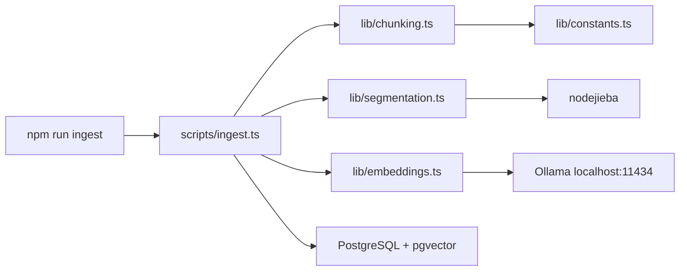
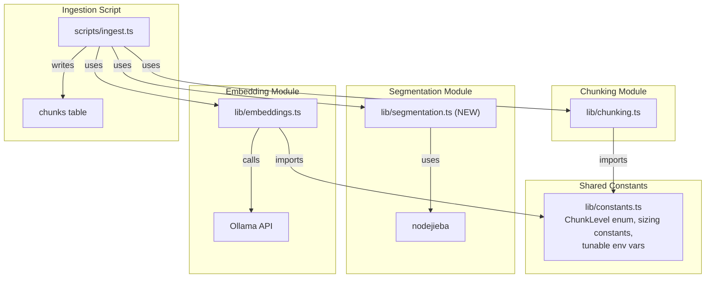
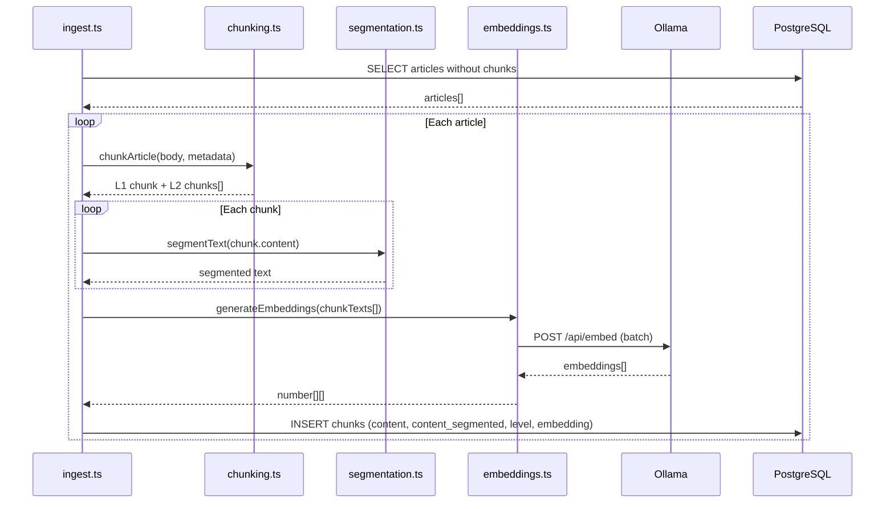
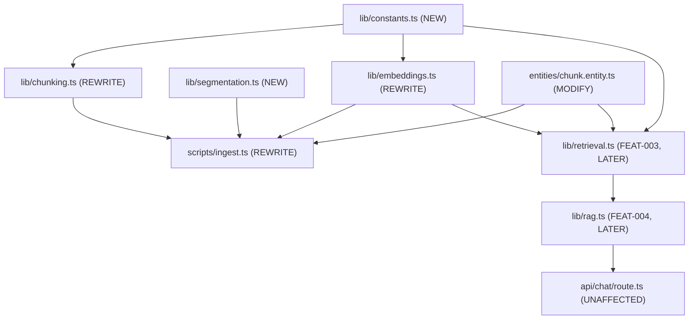

# Phase 2: Technical Design — Hierarchical Chunking & Embedding Pipeline

> **Status**: DESIGN
> **Proposal**: [01-proposal.md](./01-proposal.md)
> **Author**: Agent
> **Date**: 2026-06-24
> **Feature ID**: FEAT-002
> **Related ADR**: [ADR-0006](../../decisions/0006-embedding-model-and-chunking-strategy.md)

---

## 1. Architecture Overview

### System Context Diagram



### Component Diagram



## 2. Data Specification

### Schema Change: Add `level` Column to Chunks

```sql
-- Migration: AddChunkLevel
ALTER TABLE chunks ADD COLUMN "level" SMALLINT NOT NULL DEFAULT 1;

-- Index for filtering by level (used in retrieval WHERE level = 1 / 2)
CREATE INDEX idx_chunks_level ON chunks (level);
```

The `embedding` column stays at `vector(1024)` so it remains compatible with pgvector HNSW indexing.

### Updated Chunk Entity

```typescript
import {
  Entity, PrimaryGeneratedColumn, Column,
  ManyToOne, CreateDateColumn, JoinColumn,
} from "typeorm";
import type { Article } from "./article.entity";
import { ChunkLevel } from "@/lib/constants";

@Entity("chunks")
export class Chunk {
  @PrimaryGeneratedColumn()
  id: number;

  @Column({ type: "int", name: "article_id" })
  articleId: number;

  @Column({ type: "int", name: "chunk_index" })
  chunkIndex: number;

  @Column({ type: "smallint", default: ChunkLevel.Article })
  level: ChunkLevel;

  @Column({ type: "text" })
  content: string;

  @Column({ type: "text", nullable: true, name: "content_segmented" })
  contentSegmented: string | null;

  @Column({ type: "vector", length: 1024, nullable: true })
  embedding: number[] | null;

  @Column({ type: "int", nullable: true, name: "token_count" })
  tokenCount: number | null;

  @CreateDateColumn({ name: "created_at" })
  createdAt: Date;

  @ManyToOne("Article", "chunks", { onDelete: "CASCADE" })
  @JoinColumn({ name: "article_id" })
  article: Article;
}
```

### Shared Constants File (NEW)

```typescript
// apps/web/lib/constants.ts

/** Chunk levels for hierarchical retrieval */
export const enum ChunkLevel {
  Article = 1,
  Section = 2,
}

/** Chat message roles */
export const enum MessageRole {
  User = "user",
  Assistant = "assistant",
}

// --- Chunking constants ---
export const L1_TRUNCATION_CHARS = 2000;
export const L2_MIN_ARTICLE_CHARS = 800;
export const L2_TARGET_CHUNK_CHARS = 750;
export const L2_MAX_CHUNK_CHARS = 900;
export const L2_MIN_CHUNK_CHARS = 200;
export const L2_OVERLAP_CHARS = 100;

// --- Embedding constants ---
export const EMBEDDING_MODEL = process.env.EMBEDDING_MODEL ?? "qwen3-embedding:4b";
export const EMBEDDING_DIMENSIONS = parseInt(process.env.EMBEDDING_DIMENSIONS ?? "1024", 10);
export const EMBEDDING_BATCH_SIZE = 32;
export const OLLAMA_BASE_URL = process.env.OLLAMA_BASE_URL ?? "http://localhost:11434";

// --- Retrieval constants (tunable via .env) ---
export const VECTOR_WEIGHT = parseFloat(process.env.RETRIEVAL_VECTOR_WEIGHT ?? "0.6");
export const KEYWORD_WEIGHT = parseFloat(process.env.RETRIEVAL_KEYWORD_WEIGHT ?? "0.4");
export const FINAL_TOP_K = parseInt(process.env.RETRIEVAL_TOP_K ?? "8", 10);
export const L1_BOOST_FACTOR = parseFloat(process.env.RETRIEVAL_L1_BOOST ?? "1.3");

// --- Retrieval structural constants ---
export const RRF_K = 60;
export const L1_TOP_K = 10;
export const L2_VECTOR_TOP_K = 20;
export const L2_KEYWORD_TOP_K = 20;
```

## 3. Sequence Diagram

### Ingestion Flow (per article)



## 4. File Changes

| File | Action | Description |
|------|--------|-------------|
| `apps/web/lib/constants.ts` | **CREATE** | Shared enums (`ChunkLevel`, `MessageRole`) and named constants |
| `apps/web/lib/segmentation.ts` | **CREATE** | nodejieba wrapper: `segmentText(text: string): string` |
| `apps/web/lib/chunking.ts` | **REWRITE** | Hierarchical L1 + L2 chunking strategy |
| `apps/web/lib/embeddings.ts` | **REWRITE** | Switch from OpenAI client to Ollama HTTP client |
| `apps/web/entities/chunk.entity.ts` | **MODIFY** | Add `level` column, update comment |
| `apps/web/migrations/1700000000002-AddChunkLevel.ts` | **CREATE** | Add `level` column + index |
| `apps/web/lib/run-migrations.ts` | **MODIFY** | Register new migration class |
| `scripts/ingest.ts` | **REWRITE** | Two-level chunking + jieba segmentation + Ollama embedding |
| `apps/web/entities/index.ts` | **MODIFY** | Re-export (if not already) |
| `__tests__/lib/chunking.test.ts` | **CREATE** | Unit tests for hierarchical chunking |
| `__tests__/lib/segmentation.test.ts` | **CREATE** | Unit tests for jieba segmentation |
| `__tests__/lib/embeddings.test.ts` | **CREATE** | Unit tests for Ollama embedding client |
| `__tests__/lib/constants.test.ts` | **CREATE** | Tests for env var parsing |
| `package.json` (root) | **MODIFY** | Add `vitest` dev dependency + `test` script |
| `apps/web/package.json` | **MODIFY** | Add `@types/nodejieba` if needed |
| `vitest.config.ts` | **CREATE** | Test runner configuration |

## 5. Dependencies

### Internal Dependencies

- `lib/constants.ts` — consumed by chunking, embeddings, retrieval (FEAT-003), rag (FEAT-004)
- `lib/chunking.ts` — consumed by `scripts/ingest.ts`
- `lib/embeddings.ts` — consumed by `scripts/ingest.ts` and `lib/retrieval.ts`
- `lib/segmentation.ts` — consumed by `scripts/ingest.ts`
- `entities/chunk.entity.ts` — consumed by `scripts/ingest.ts`, retrieval, rag

### External Dependencies (new packages)

| Package | Version | Purpose | Size Impact |
|---------|---------|---------|-------------|
| `vitest` | `^3.x` | Test runner (fast, ESM-native, Vite-based) | Dev only |
| `@vitest/coverage-v8` | `^3.x` | Coverage reporting | Dev only |

**Why Vitest over Jest**: ESM-native (no transform issues with Next.js), faster, same `expect` API, better TypeScript support out of the box. Jest requires extra config for ESM/decorators.

### Existing packages used (no install needed)

| Package | Purpose |
|---------|---------|
| `nodejieba` | Already installed, just not imported. Chinese word segmentation. |
| `pgvector` | Already installed. `pgvector.toSql()` for embedding SQL. |

## 6. Testing Strategy (TDD)

Tests are written BEFORE implementation. Follow Red-Green-Refactor.

### Test Infrastructure Setup

```typescript
// vitest.config.ts
import { defineConfig } from "vitest/config";
import path from "path";

export default defineConfig({
  test: {
    globals: true,
    environment: "node",
    include: ["__tests__/**/*.test.ts"],
    coverage: {
      provider: "v8",
      include: ["apps/web/lib/**"],
      thresholds: {
        statements: 60,
        branches: 60,
        functions: 60,
        lines: 60,
      },
    },
  },
  resolve: {
    alias: {
      "@": path.resolve(__dirname, "apps/web"),
    },
  },
});
```

**Coverage requirement**: >= 60% on statements, branches, functions, and lines. The test runner will **fail** if coverage drops below this threshold.

### Test Plan

| AC ID | Test File | Test Description | Type |
|-------|-----------|------------------|------|
| AC-1 | `__tests__/lib/chunking.test.ts` | Any article produces exactly one L1 chunk with metadata prefix | Unit |
| AC-2 | `__tests__/lib/chunking.test.ts` | 2000-char article produces 1 L1 + 2-3 L2 chunks (600-900 chars) | Unit |
| AC-3 | `__tests__/lib/chunking.test.ts` | Article < 800 chars produces only L1, zero L2 | Unit |
| AC-4 | `__tests__/lib/chunking.test.ts` | Adjacent L2 chunks overlap by ~100 chars | Unit |
| AC-5 | `__tests__/lib/chunking.test.ts` | L1 chunk starts with metadata prefix (title, date, section) | Unit |
| AC-6 | `__tests__/lib/segmentation.test.ts` | Chinese text returns space-separated jieba words | Unit |
| AC-7 | `__tests__/lib/embeddings.test.ts` | `generateEmbedding()` returns 1024-dim array (mocked Ollama) | Unit |
| AC-8 | — | Article with existing chunks is skipped on re-run | Integration (deferred) |
| AC-9 | `__tests__/lib/chunking.test.ts` | Article > 2000 chars: L1 truncated, L2 covers full text | Unit |
| AC-10 | `__tests__/lib/embeddings.test.ts` | Ollama unreachable throws typed error | Unit |

### Test Infrastructure Needed

- [x] `vitest` installed as dev dependency
- [x] `vitest.config.ts` with `@/` alias resolution and 60% coverage threshold
- [ ] Mock helper for Ollama HTTP responses
- [ ] Sample article fixtures (short, medium, long)

### Test Fixtures

```typescript
// __tests__/fixtures/articles.ts
export const SHORT_ARTICLE = {
  id: 1,
  body: "6月11日下午，软件学院党委召开会议。王建民、王朝坤等当选新一届委员。",
  title: "软件学院召开党员大会",
  section: "新闻动态",
  publishedDate: "2026-06-15",
};
// ~45 chars — L1 only, no L2

export const MEDIUM_ARTICLE = {
  id: 2,
  body: "...".repeat(350), // ~1050 chars
  title: "中等长度文章",
  section: "新闻动态",
  publishedDate: "2024-01-15",
};
// ~1050 chars — L1 + 2 L2 chunks

export const LONG_ARTICLE = {
  id: 3,
  body: "...".repeat(800), // ~2400 chars
  title: "长文章示例",
  section: "科研成果",
  publishedDate: "2023-06-01",
};
// ~2400 chars — L1 (truncated to 2000) + 3-4 L2 chunks
```

## 7. Blast Radius Analysis

### Dependency Graph



### Migration Safety

- **Backward compatible?** Yes — `level` column has `DEFAULT 1`, so existing data (if any) is valid. But chunks table is currently empty, so this is moot.
- **Downtime required?** None — migration runs before ingest
- **Data re-processing needed?** Full ingest (table is empty, so this is the first ingest)

## 8. Anti-Patterns & Guardrails

| Anti-Pattern | Detection Method | Guardrail |
|-------------|-----------------|-----------|
| Magic number `1` or `2` for chunk level | Code review / grep | `const enum ChunkLevel` — TypeScript compiler error if raw number used |
| Hardcoded `750`, `900`, `100` in chunking logic | Code review | Named constants from `constants.ts` |
| `content_segmented` stored as raw unsegmented text | Unit test AC-6 + SQL check | `segmentText()` called for every chunk before INSERT |
| Embedding API called with wrong model | Unit test AC-7 | Model name from `EMBEDDING_MODEL` env/constant |
| Embedding dimension mismatch (not 1024) | Unit test AC-7 | Validate array length in test |
| Using `openai` npm package for Ollama | Code review | Direct HTTP fetch to Ollama `/api/embed` endpoint |

## 9. Security Design

### Input Validation

| Input | Validation | Sanitization |
|-------|-----------|-------------|
| Article body text | Non-null, non-empty (skip if empty) | Trim whitespace |
| Ollama response | Check HTTP status, validate embedding length | Throw typed error on failure |

### Data Protection

- **Secrets handling**: No API keys needed (Ollama is local). `OLLAMA_BASE_URL` is not sensitive.
- **Data exposure**: Ingest script is CLI-only, not exposed to network.
- **Injection prevention**: Raw SQL uses parameterized queries (`$1`, `$2`, etc.).

## 10. Performance Considerations

| Operation | Estimated Time | Bottleneck |
|-----------|---------------|-----------|
| Chunking 811 articles | < 1 second | CPU (trivial) |
| Jieba segmentation ~1672 chunks | ~5 seconds | CPU (nodejieba is C++ native) |
| Embedding ~1672 chunks (qwen3-embedding:4b) | ~15-25 minutes | GPU/CPU (4b model on M1 Pro) |
| INSERT ~1672 rows | < 2 seconds | Disk I/O (trivial) |
| **Total ingest time** | **~15-25 minutes** | Embedding is the bottleneck |

### Optimization Notes

- Embedding is done in batches (Ollama supports batch input via `/api/embed`)
- We can parallelize embedding batches if Ollama supports concurrent requests (test this)
- HNSW index rebuild after bulk insert is automatic

## 11. Rollback Plan

1. Drop all chunks: `TRUNCATE chunks;`
2. Revert migration: `ALTER TABLE chunks DROP COLUMN level; DROP INDEX idx_chunks_level;`
3. Restore old `chunking.ts`, `embeddings.ts`, `ingest.ts` from git
4. Re-ingest with old pipeline (but we won't — table was empty)

Since the chunks table is currently empty, rollback is trivial: just truncate and re-run.

---

## Module API Specifications

### `lib/constants.ts` — Enums and Constants

Already specified above in section 2.

### `lib/segmentation.ts` — Chinese Word Segmentation

```typescript
/**
 * Segment Chinese text into space-separated words using jieba.
 * Required for PostgreSQL tsvector keyword search on Chinese content.
 */
export function segmentText(text: string): string;
```

Implementation: call `nodejieba.cut(text)` (search mode), join with spaces, return.

### `lib/chunking.ts` — Hierarchical Chunking

```typescript
import { ChunkLevel } from "@/lib/constants";

export interface ChunkMetadata {
  title: string;
  section: string | null;
  publishedDate: string | null;
}

export interface ChunkData {
  articleId: number;
  chunkIndex: number;
  level: ChunkLevel;
  content: string;
  tokenCount: number;
}

/**
 * Chunk an article into L1 (article-level) + L2 (section-level) chunks.
 *
 * Rules:
 * - Always produces exactly 1 L1 chunk (full text, truncated at 2000 chars if needed)
 * - Produces L2 chunks only if body >= 800 chars
 * - L2 chunks are 600-900 chars with ~100 char overlap
 * - All chunks get metadata prefix (title, date, section)
 */
export function chunkArticle(body: string, metadata: ChunkMetadata): ChunkData[];
```

### `lib/embeddings.ts` — Ollama Embedding Client

```typescript
/**
 * Generate embeddings via local Ollama (qwen3-embedding:4b).
 * Uses HTTP POST to /api/embed (not OpenAI-compatible endpoint).
 */
export async function generateEmbeddings(texts: string[]): Promise<number[][]>;

/**
 * Generate a single embedding for a query string.
 */
export async function generateQueryEmbedding(query: string): Promise<number[]>;
```

Ollama `/api/embed` request:

```json
{
  "model": "qwen3-embedding:4b",
  "input": ["text1", "text2"]
}
```

Ollama `/api/embed` response:

```json
{
  "model": "qwen3-embedding:4b",
  "embeddings": [[0.1, 0.2, ...], [0.3, 0.4, ...]]
}
```

No `openai` npm package needed. Direct `fetch()` to Ollama.

---

## Sign-off

- [ ] Architecture reviewed
- [ ] Data spec agreed
- [ ] Test plan covers all ACs
- [ ] Ready for Phase 3 (Tasks)
