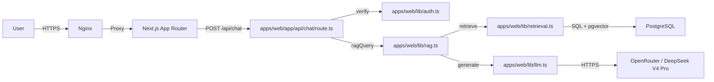
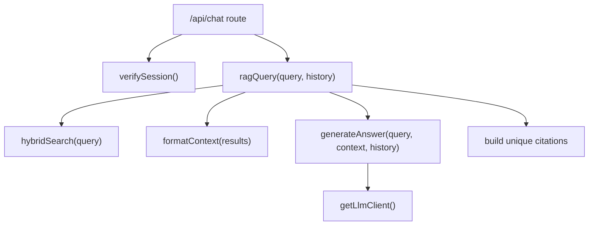
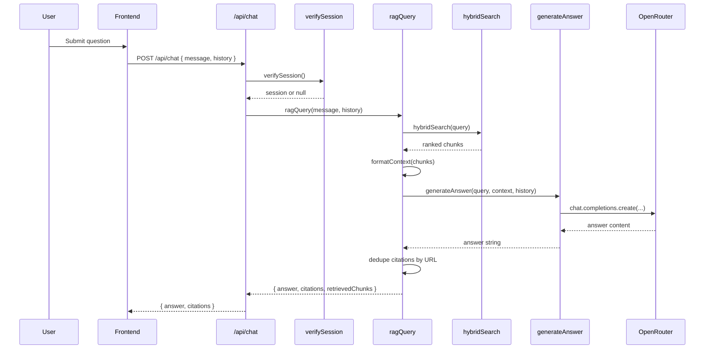
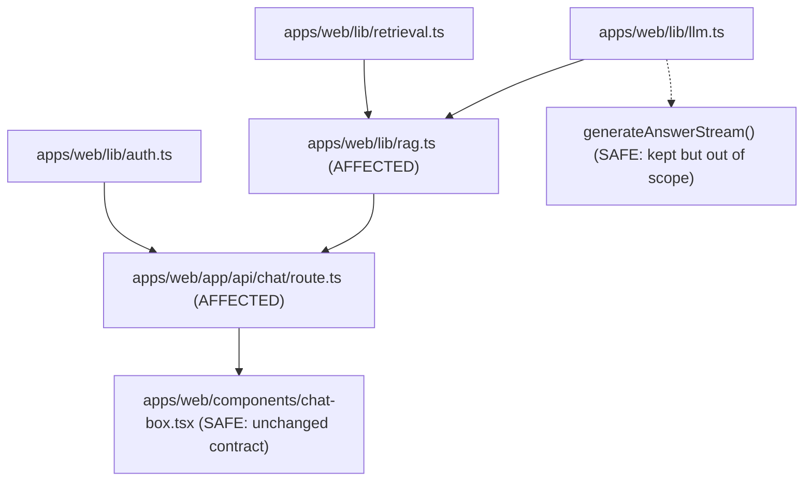

# Phase 2: Technical Design — RAG Pipeline & LLM Integration

> **Status**: DESIGN
> **Proposal**: [01-proposal.md](/Users/alan/development/tke-rag-chatbot/docs/active/FEAT-004-rag-pipeline/01-proposal.md)
> **Author**: Agent
> **Date**: 2026-06-24
> **Feature ID**: FEAT-004

---

## 1. Architecture Overview

FEAT-004 formalizes the server-side question answering path that already exists in code: authenticated chat request enters the Node.js route, the RAG service retrieves ranked chunks, formats them into bounded context, sends a constrained prompt to the LLM, then returns an answer plus deduplicated citations.

This feature is intentionally **backend-only** for v1:
- **Included**: synchronous answer generation, prompt construction, citation extraction, typed error handling, unit and integration tests
- **Excluded**: streaming API responses, markdown rendering in the UI

Markdown rendering belongs to FEAT-005. Streaming exists in `apps/web/lib/llm.ts` today, but wiring it into `/api/chat` is deferred to a later feature.

### System Context Diagram



### Component Diagram



## 2. Data Specification

### New Entities / Schema Changes

No database schema changes are required for FEAT-004.

The feature consumes existing types and retrieval results:

```typescript
interface RagResponse {
  answer: string;
  citations: Citation[];
  retrievedChunks: RetrievalResult[];
}

interface Citation {
  title: string;
  url: string;
  section: string | null;
  date: string | null;
}

interface LlmMessage {
  role: "system" | MessageRole;
  content: string;
}
```

### Database Migration

None.

### API Contracts

#### Endpoint: `POST /api/chat`

Auth is required via session cookie verified by `verifySession()`.

**Request:**
```json
{
  "message": "string - required user question",
  "history": [
    {
      "role": "user | assistant",
      "content": "string"
    }
  ]
}
```

**Response:**
```json
{
  "answer": "string - LLM answer constrained to retrieved context",
  "citations": [
    {
      "title": "string",
      "url": "string",
      "section": "string | null",
      "date": "YYYY-MM-DD | null"
    }
  ]
}
```

**Error Responses:**

| Status | Code | Description |
|--------|------|-------------|
| 400 | `INVALID_MESSAGE` | `message` missing or not a string |
| 401 | `UNAUTHORIZED` | Session missing or invalid |
| 500 | `RAG_PIPELINE_ERROR` | Retrieval or LLM generation failed |

### Internal LLM Contract

`generateAnswer()` sends one system message, zero or more conversation-history messages, and one final user message whose content is:

```text
Context:
{formatted_context}

Question: {query}
```

This design keeps the prompt contract stable and directly testable.

## 3. Sequence Diagram



## 4. File Changes

| File | Action | Description |
|------|--------|-------------|
| `apps/web/lib/__tests__/llm.test.ts` | CREATE | Unit tests for prompt construction, client calls, and error behavior |
| `apps/web/lib/__tests__/rag.test.ts` | CREATE | Unit tests for context formatting integration, refusal path, and citation deduplication |
| `apps/web/app/api/chat/route.test.ts` or `apps/web/app/api/chat/__tests__/route.test.ts` | CREATE | Route-level tests for auth, input validation, and response shaping |
| `apps/web/lib/llm.ts` | MODIFY | Introduce lazy OpenRouter client construction and named constants for LLM settings |
| `apps/web/lib/rag.ts` | MODIFY | Centralize fallback answer constant, extract citation builder helper, harden date handling |
| `apps/web/types/index.ts` | MODIFY | Keep RAG/LLM shared types as the single source of truth if tests reveal missing type coverage |
| `docs/active/FEAT-004-rag-pipeline/03-tasks.md` | CREATE | Ordered TDD task list for implementation |
| `docs/active/FEAT-004-rag-pipeline/04-verification.md` | CREATE | AC verification evidence after implementation |

## 5. Dependencies

### Internal Dependencies

- `apps/web/lib/retrieval.ts`: provides `hybridSearch()` and `formatContext()`
- `apps/web/lib/auth.ts`: session verification for `/api/chat`
- `apps/web/lib/constants.ts`: `MessageRole` and future LLM-related constants if extracted
- `apps/web/types/index.ts`: `ChatMessage`, `Citation`, `LlmMessage`, `RagResponse`

### External Dependencies (new packages)

No new packages are required.

| Package | Version | Purpose | Size Impact |
|---------|---------|---------|-------------|
| None | — | Reuse existing `openai`, `vitest`, and Next.js test setup | None |

## 6. Testing Strategy (TDD)

Tests are written before implementation. The first RED step should cover the known gap: `llm.ts` eagerly creates an OpenAI client at module load, which breaks `npm run build` when env resolution is not present during import-time execution.

### Test Plan

| AC ID | Test File | Test Description | Type |
|-------|-----------|------------------|------|
| AC-1 | `apps/web/lib/__tests__/rag.test.ts` | `ragQuery()` returns answer and retrieved chunks derived from mocked retrieval + mocked LLM | Integration |
| AC-2 | `apps/web/lib/__tests__/rag.test.ts` | Duplicate article chunks produce one citation entry per URL | Unit |
| AC-3 | `apps/web/lib/__tests__/rag.test.ts` | Empty retrieval returns the refusal answer and no citations without calling the LLM | Unit |
| AC-4 | `apps/web/lib/__tests__/llm.test.ts` | Generated message list includes system prompt instruction to answer in the user language | Unit |
| AC-5 | `apps/web/lib/__tests__/rag.test.ts` | Retrieved chunks are formatted into numbered context blocks before generation | Unit |
| AC-6 | `apps/web/lib/__tests__/llm.test.ts` | `generateAnswer()` sends the constrained system prompt and final `Context + Question` user message | Unit |
| AC-7 | `apps/web/lib/__tests__/rag.test.ts` | Multiple chunks from the same article remain deduplicated in the citation list | Unit |
| AC-8 | `apps/web/lib/__tests__/llm.test.ts` | LLM client errors are surfaced as typed or stable route-catchable failures | Unit |

### Additional Regression Tests

| Scenario | Test File | Type |
|----------|-----------|------|
| `/api/chat` returns `401` when no session exists | `apps/web/app/api/chat/route.test.ts` | Integration |
| `/api/chat` returns `400` for missing `message` | `apps/web/app/api/chat/route.test.ts` | Integration |
| `/api/chat` returns answer + citations JSON shape for valid request | `apps/web/app/api/chat/route.test.ts` | Integration |
| Importing `llm.ts` without env-loaded client creation does not fail immediately | `apps/web/lib/__tests__/llm.test.ts` | Unit |

### Test Infrastructure Needed

- [x] Mock setup for external APIs
- [x] Mocking strategy for retrieval and auth helpers
- [ ] Shared helper for creating typed `RetrievalResult` fixtures if test duplication grows
- [ ] Decide final location for route tests based on existing Vitest alias resolution

## 7. Blast Radius Analysis

This change touches the server-side answer path but does not alter persistence, retrieval scoring, or UI rendering.

### Dependency Graph



### Migration Safety

- **Backward compatible?** Yes
- **Downtime required?** None
- **Data re-processing needed?** None

## 8. Anti-Patterns & Guardrails

| Anti-Pattern | Detection Method | Guardrail |
|-------------|-----------------|-----------|
| Eagerly constructing the OpenAI client at module import time | Build failure, import-time test failure | Use a lazy `getLlmClient()` helper that validates env at call time |
| Repeating LLM config magic numbers and strings inline | Code review and tests | Extract named constants for model, temperature, max tokens, fallback answer |
| Mixing UI concerns into FEAT-004 | File manifest review | Do not modify `chat-message.tsx` or markdown rendering here |
| Converting all LLM failures to silent fallback answers | Unit tests and route tests | Surface server errors to the route; only empty retrieval gets the explicit refusal answer |
| Deduplicating citations by title instead of stable URL | Unit tests | Deduplicate using `citation.url` only |

## 9. Security Design

### Input Validation

| Input | Validation | Sanitization |
|-------|-----------|-------------|
| `message` | Required, string, non-empty after trim | Trim leading/trailing whitespace before RAG call if needed |
| `history` | Optional array of `{ role, content }` objects | Treat as plain text only; do not interpolate into system prompt |
| LLM env vars | Required on demand for generation | Validate presence inside lazy client getter |

### Data Protection

- **Secrets handling**: `LLM_API_KEY` remains server-side only. The design removes import-time dependency on env-loaded client creation to reduce accidental build/runtime leakage.
- **Data exposure**: Client receives only `answer` and `citations`. Retrieved chunk content stays server-side.
- **Injection prevention**:
  - SQL injection remains handled by retrieval layer parameterization.
  - XSS rendering is outside this feature and remains a FEAT-005 concern.
  - Prompt injection is mitigated only partially through system-message separation and strict context-only instructions; no claim is made that prompt injection is fully solved.

## 10. Performance Considerations

- Retrieval remains the dominant local cost; FEAT-004 adds no new database queries.
- LLM latency target remains under 10 seconds average for synchronous answers.
- Lazy client construction has negligible overhead compared with the network call and prevents build-time failure.
- Conversation history is passed through as-is; if latency or token use grows later, history truncation should be handled in a separate feature, not folded into this one.

## 11. Rollback Plan

If FEAT-004 changes regress production behavior:

1. Revert `apps/web/lib/llm.ts`, `apps/web/lib/rag.ts`, and associated tests.
2. Keep the existing `/api/chat` response contract unchanged so rollback is code-only.
3. Re-run:
   - `npm test`
   - `npm run typecheck`
   - `npm run build`
4. Redeploy without any schema or data rollback.

---

## Sign-off

- [ ] Architecture reviewed
- [ ] Data spec agreed
- [ ] Test plan covers all ACs
- [ ] Ready for Phase 3 (Tasks)
