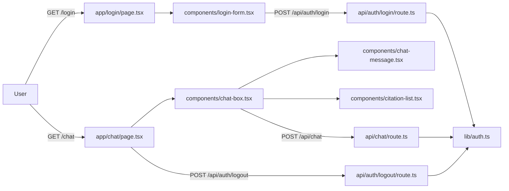
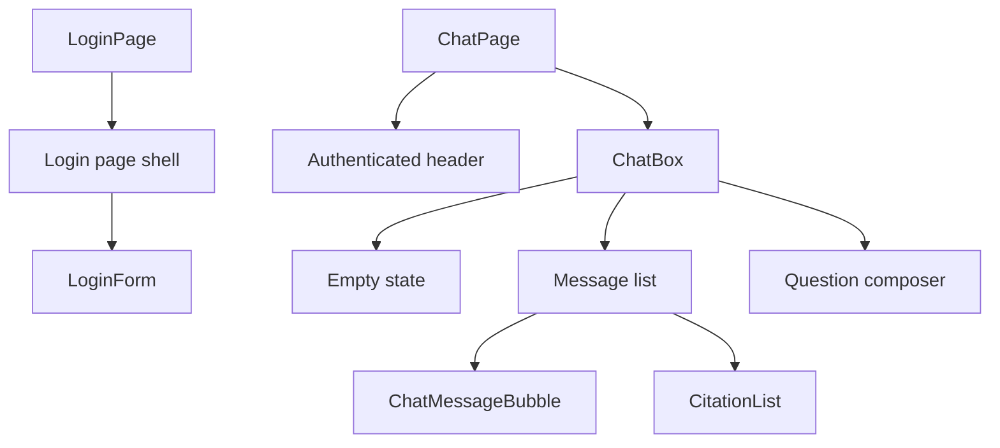
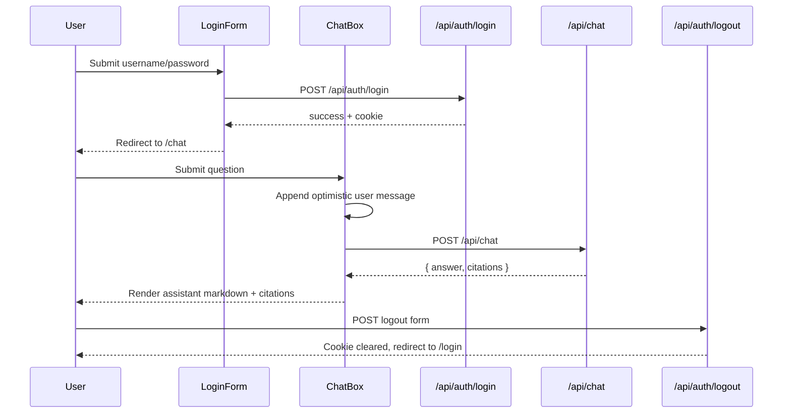
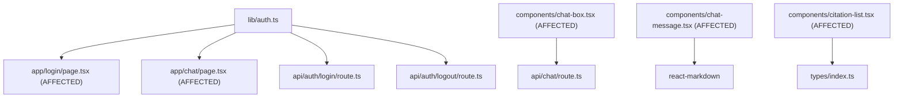

# Phase 2: Technical Design — Authentication & Chat UI

> **Status**: DESIGN
> **Proposal**: [01-proposal.md](/Users/alan/development/tke-rag-chatbot/docs/active/FEAT-005-auth-chat-ui/01-proposal.md)
> **Author**: Agent
> **Date**: 2026-06-24
> **Feature ID**: FEAT-005

---

## 1. Architecture Overview

FEAT-005 covers the authenticated user-facing experience: login flow, chat shell, message rendering, citations, loading states, and markdown output presentation. The backend contract already exists, so this feature focuses on turning the current plain Tailwind UI into a cleaner academic knowledge-console experience while adding missing tests and markdown rendering.

### UI Direction

This UI is for evaluators and internal users asking factual questions about Tsinghua School of Software content. The single job of the page is to get users from login to answer verification with as little friction as possible.

Chosen visual direction:
- **Subject**: academic knowledge system for a bilingual university corpus
- **Audience**: evaluators and operators validating answer quality quickly
- **Single job**: submit a question, read a grounded answer, inspect sources

Chosen identity:
- **Look**: “research console” rather than startup SaaS dashboard
- **Palette**:
  - `Ink` `#0F172A`
  - `Slate` `#334155`
  - `Paper` `#F8FAFC`
  - `Porcelain` `#E2E8F0`
  - `Tsinghua Crimson` `#7A1F2B`
  - `Signal Gold` `#C9A227`
- **Type roles**:
  - Display/headings: existing system stack for now, with tighter spacing and stronger weight
  - Body/input: existing system stack for now, kept readable and compact
  - Utility/meta: monospaced styling for citation metadata and small labels
- **Signature element**: subtle dossier-style framing around answer citations and section labels, so the source-verification aspect feels central instead of tacked on

This feature does **not** introduce streaming. Markdown rendering is included here. Full shadcn/TanStack migration remains aligned with ADR-0002, but implementation should stay scoped enough to complete the required auth/chat behaviors first.

### System Context Diagram



### Component Diagram



## 2. Data Specification

### New Entities / Schema Changes

No database schema changes are required.

This feature consumes existing shared types:

```typescript
interface DisplayMessage {
  role: MessageRole;
  content: string;
  citations?: Citation[];
}

interface Citation {
  title: string;
  url: string;
  section: string | null;
  date: string | null;
}
```

### Database Migration

None.

### API Contracts

#### Endpoint: `POST /api/auth/login`

**Request:**
```json
{
  "username": "string",
  "password": "string"
}
```

**Response:**
```json
{
  "success": true
}
```

**Error Responses:**

| Status | Code | Description |
|--------|------|-------------|
| 400 | `INVALID_INPUT` | Username or password missing |
| 401 | `INVALID_CREDENTIALS` | Credentials do not match env vars |
| 500 | `INTERNAL_ERROR` | Session creation failed |

#### Endpoint: `POST /api/auth/logout`

**Request:** no body required

**Response:**
```json
{
  "success": true
}
```

#### Endpoint: `POST /api/chat`

**Request:**
```json
{
  "message": "string",
  "history": [
    {
      "role": "user | assistant",
      "content": "string"
    }
  ]
}
```

**Response:**
```json
{
  "answer": "string",
  "citations": [
    {
      "title": "string",
      "url": "string",
      "section": "string | null",
      "date": "YYYY-MM-DD | null"
    }
  ]
}
```

## 3. Sequence Diagram



## 4. File Changes

| File | Action | Description |
|------|--------|-------------|
| `apps/web/lib/__tests__/auth.test.ts` | CREATE | Unit tests for credential validation, session verification success/failure, and cookie-related auth behavior where feasible |
| `apps/web/components/__tests__/login-form.test.tsx` | CREATE | Component tests for valid submit, invalid credential error display, loading state, and disabled controls |
| `apps/web/components/__tests__/chat-box.test.tsx` | CREATE | Component tests for empty state, submit flow, loading indicator, input disabling, and fallback error message |
| `apps/web/components/__tests__/chat-message.test.tsx` | CREATE | Rendering tests for markdown output in assistant messages and plain user bubbles |
| `apps/web/components/__tests__/citation-list.test.tsx` | CREATE | Tests for citation label, metadata rendering, and external links |
| `apps/web/app/login/page.test.tsx` or server-page equivalent | CREATE | Guard test verifying authenticated users redirect away from `/login` |
| `apps/web/app/chat/page.test.tsx` or server-page equivalent | CREATE | Guard test verifying unauthenticated users redirect to `/login` |
| `apps/web/lib/auth.ts` | MODIFY | Extract named constants and harden typed behavior only if tests require it |
| `apps/web/components/login-form.tsx` | MODIFY | Improve layout, submit state, error handling, and consistent wording |
| `apps/web/components/chat-box.tsx` | MODIFY | Improve shell layout, loading UX, chat composition, and error messaging |
| `apps/web/components/chat-message.tsx` | MODIFY | Render assistant markdown via `react-markdown`; keep user messages as plain text |
| `apps/web/components/citation-list.tsx` | MODIFY | Restyle citations as verifiable source records with clearer metadata hierarchy |
| `apps/web/app/login/page.tsx` | MODIFY | Add the refined login shell and layout framing |
| `apps/web/app/chat/page.tsx` | MODIFY | Add stronger chat header and overall page framing |
| `apps/web/app/globals.css` | MODIFY | Introduce shared surface, text, and accent variables for the FEAT-005 visual identity |
| `docs/active/FEAT-005-auth-chat-ui/03-tasks.md` | CREATE | Ordered TDD implementation plan |
| `docs/active/FEAT-005-auth-chat-ui/04-verification.md` | CREATE | Verification matrix and evidence |

## 5. Dependencies

### Internal Dependencies

- `apps/web/lib/auth.ts`
- `apps/web/app/api/auth/login/route.ts`
- `apps/web/app/api/auth/logout/route.ts`
- `apps/web/app/api/chat/route.ts`
- `apps/web/types/index.ts`
- `apps/web/lib/constants.ts`

### External Dependencies (new packages)

No new packages are required for the minimum FEAT-005 scope because `react-markdown` is already installed.

Potential follow-up dependencies from ADR-0002 are intentionally deferred unless required during implementation:
- `@tanstack/react-query`
- shadcn/ui component dependencies

| Package | Version | Purpose | Size Impact |
|---------|---------|---------|-------------|
| `react-markdown` | already installed | Safe markdown rendering for assistant messages | already present |

## 6. Testing Strategy (TDD)

Tests are written before implementation. The feature mixes server auth logic and client UI, so the order should move from deterministic logic to interactive components.

### Test Plan

| AC ID | Test File | Test Description | Type |
|-------|-----------|------------------|------|
| AC-1 | `apps/web/components/__tests__/login-form.test.tsx` | Valid credentials submission triggers login request and navigation to `/chat` | Integration |
| AC-2 | `apps/web/components/__tests__/login-form.test.tsx` | Invalid login response renders error message and does not navigate | Unit |
| AC-3 | `apps/web/app/chat/page.test.tsx` | Missing session triggers redirect to `/login` | Unit |
| AC-4 | `apps/web/components/__tests__/chat-box.test.tsx` | User submission appends user message and later assistant message | E2E-style component/integration |
| AC-5 | `apps/web/components/__tests__/citation-list.test.tsx` | Citation links render title, section, date, and external href correctly | Unit |
| AC-6 | `apps/web/lib/__tests__/auth.test.ts` plus login/logout route tests if needed | Logout clears session and redirect behavior remains correct | Integration |
| AC-7 | `apps/web/components/__tests__/chat-box.test.tsx` | Loading indicator shows and input is disabled during answer fetch | Unit |
| AC-8 | `apps/web/lib/__tests__/auth.test.ts` | Valid session verifies successfully | Unit |
| AC-9 | `apps/web/lib/__tests__/auth.test.ts` | Tampered or expired session returns null | Unit |
| BR-7 | `apps/web/components/__tests__/chat-message.test.tsx` | Assistant messages render markdown content safely without `dangerouslySetInnerHTML` | Unit |

### Test Infrastructure Needed

- [ ] React component test setup for client components if not already present
- [ ] Mocking for `next/navigation` router and redirects
- [ ] Mocking for `fetch` in login/chat component tests
- [ ] Cookie/session mocking strategy for auth tests

## 7. Blast Radius Analysis

This feature affects only the authenticated UI path and auth/session helpers.

### Dependency Graph



### Migration Safety

- **Backward compatible?** Yes
- **Downtime required?** None
- **Data re-processing needed?** None

## 8. Anti-Patterns & Guardrails

| Anti-Pattern | Detection Method | Guardrail |
|-------------|-----------------|-----------|
| Rendering LLM output with `dangerouslySetInnerHTML` | Code review and component tests | Use `react-markdown` only |
| Replacing the whole UI with a large dependency migration in one pass | File manifest review | Keep FEAT-005 scoped to auth/chat behavior and presentation, not a full design-system rewrite |
| Losing current `/api/chat` request/response contract | Chat-box tests and route tests | Preserve `message/history` request and `answer/citations` response |
| Letting user and assistant bubbles use the same markdown renderer | Component tests | User messages remain plain text; assistant messages render markdown |
| Over-styling the page into a generic dashboard | Visual review against design direction | Keep the “research console” identity focused on citations, labels, and calm structure |

## 9. Security Design

### Input Validation

| Input | Validation | Sanitization |
|-------|-----------|-------------|
| Login username/password | Required, string, non-empty | Send as JSON body only; no client-side persistence |
| Chat message | Required, non-empty after trim | Preserve plain user text; do not render user input as markdown |
| Assistant markdown | Treat as untrusted content | Render via `react-markdown`, not raw HTML injection |

### Data Protection

- **Secrets handling**: auth credentials and secret stay in server env vars.
- **Data exposure**: UI receives only answer, citations, and auth success/failure status.
- **Injection prevention**:
  - JWT remains in `HttpOnly` cookie.
  - Assistant output avoids raw HTML insertion.
  - External citation links remain `target="_blank"` with `rel="noopener noreferrer"`.

## 10. Performance Considerations

- Markdown rendering cost is small relative to answer generation and only applies to assistant messages.
- Chat scrolling should remain simple and client-side; no virtualization is needed at current history size.
- CSS changes should stay lightweight and mostly variable-driven in `globals.css`.
- Avoid unnecessary state duplication between local state and fetch results.

## 11. Rollback Plan

If FEAT-005 causes UI regressions:

1. Revert component/page/auth test additions and UI changes.
2. Keep auth API routes and backend RAG contract unchanged.
3. Re-run:
   - `npm test`
   - `npm run typecheck`
   - `npm run build`
4. Redeploy with the previous login/chat presentation.

---

## Sign-off

- [ ] Architecture reviewed
- [ ] Data spec agreed
- [ ] Test plan covers all ACs
- [ ] Ready for Phase 3 (Tasks)
