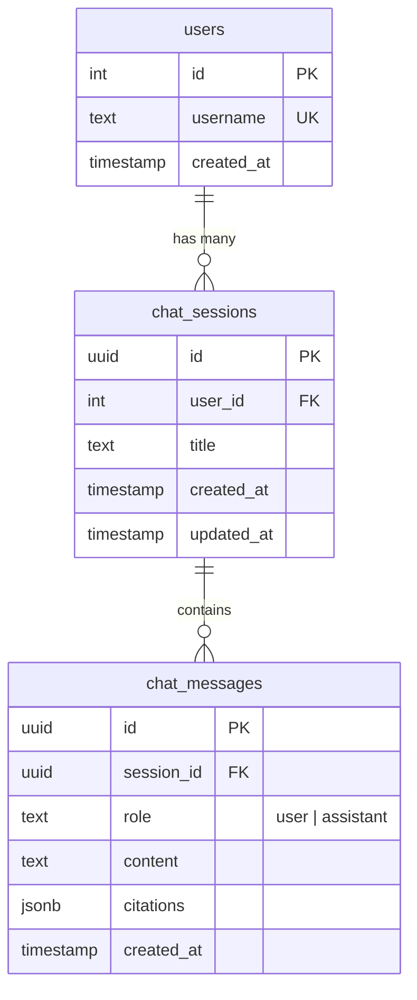

# ADR-0003: Chat History Persistence — User + ChatSession + ChatMessage Tables

> **Status**: Accepted
> **Date**: 2026-06-23
> **Deciders**: Alan, Agent
> **Scope**: Database schema, API routes, chat UI

---

## Context and Problem Statement

Currently, chat messages exist only in React component state (`useState` in `chat-box.tsx`). When a user refreshes the page or logs out, all conversation history is lost. For a production-grade chatbot, we need persistent chat history so users can resume conversations and evaluators can see interaction quality.

This requires new database entities (User, ChatSession, ChatMessage) and corresponding API changes.

## Decision Drivers

- Current state: messages lost on page refresh (React state only)
- Evaluators test the system via provided credentials — seeing history demonstrates completeness
- Challenge requires "message history" in the chat interface
- Need to track which user asked which questions (even with single demo user)
- Future-proofs multi-user support if needed

## Blast Radius

### New Files to Create

| File | Purpose |
|------|---------|
| `apps/web/entities/user.entity.ts` | User entity (id, username, passwordHash, createdAt) |
| `apps/web/entities/chat-session.entity.ts` | ChatSession entity (id, userId, title, createdAt) |
| `apps/web/entities/chat-message.entity.ts` | ChatMessage entity (id, sessionId, role, content, citations, createdAt) |
| `apps/web/migrations/1700000000002-AddChatHistory.ts` | Migration for new tables |
| `apps/web/app/api/chat/sessions/route.ts` | List/create sessions |
| `apps/web/app/api/chat/sessions/[id]/route.ts` | Get session messages |
| `apps/web/app/api/chat/sessions/[id]/messages/route.ts` | Add message to session |

### Files to Modify

| File | Change |
|------|--------|
| `apps/web/entities/index.ts` | Export new entities |
| `apps/web/lib/db.ts` | Register new entities |
| `apps/web/lib/auth.ts` | Return user ID from session verification |
| `apps/web/app/api/chat/route.ts` | Save messages + citations to DB after RAG response |
| `apps/web/components/chat-box.tsx` | Load history on mount, save new messages |
| `apps/web/app/chat/page.tsx` | Session list sidebar or session selector |

### UNAFFECTED

| Component | Reason |
|-----------|--------|
| `apps/web/lib/rag.ts` | Pipeline is stateless — doesn't know about sessions |
| `apps/web/lib/retrieval.ts` | Search is independent of chat history |
| `scripts/*` | Crawler/ingest don't touch chat data |

## Considered Options

### Option A: No persistence (current)
- **Pro**: Simplest, no schema changes
- **Con**: Messages lost on refresh, looks unfinished to evaluators
- **Verdict**: Inadequate for "production-grade" requirement

### Option B: LocalStorage persistence
- **Pro**: No backend changes, survives page refresh
- **Con**: Not server-side, lost on device change, can't associate with user, no server-side audit trail
- **Verdict**: Feels hacky, doesn't satisfy "production-grade"

### Option C: Database persistence with User + Session + Message (Chosen)
- **Pro**: Full persistence, server-authoritative, supports multi-session, query-able
- **Con**: Requires new entities + migration + API routes
- **Verdict**: Proper solution, aligns with production-grade expectations

## Decision Outcome

**Chosen: Option C — Database persistence**

### Data Schema



### Entity Definitions

```typescript
// User — maps to existing auth credentials
@Entity("users")
class User {
  @PrimaryGeneratedColumn()
  id: number;

  @Column({ type: "text", unique: true })
  username: string;

  @Column({ type: "timestamp", default: () => "CURRENT_TIMESTAMP" })
  createdAt: Date;

  @OneToMany(() => ChatSession, (s) => s.user)
  sessions: ChatSession[];
}

// ChatSession — groups messages into conversations
@Entity("chat_sessions")
class ChatSession {
  @PrimaryGeneratedColumn("uuid")
  id: string;

  @ManyToOne(() => User, (u) => u.sessions)
  @JoinColumn({ name: "user_id" })
  user: User;

  @Column({ type: "text", nullable: true })
  title: string; // auto-generated from first message

  @Column({ type: "timestamp", default: () => "CURRENT_TIMESTAMP" })
  createdAt: Date;

  @Column({ type: "timestamp", default: () => "CURRENT_TIMESTAMP" })
  updatedAt: Date;

  @OneToMany(() => ChatMessage, (m) => m.session)
  messages: ChatMessage[];
}

// ChatMessage — individual messages within a session
@Entity("chat_messages")
class ChatMessage {
  @PrimaryGeneratedColumn("uuid")
  id: string;

  @ManyToOne(() => ChatSession, (s) => s.messages, { onDelete: "CASCADE" })
  @JoinColumn({ name: "session_id" })
  session: ChatSession;

  @Column({ type: "text" })
  role: "user" | "assistant";

  @Column({ type: "text" })
  content: string;

  @Column({ type: "jsonb", nullable: true })
  citations: Array<{ title: string; url: string; section?: string; date?: string }>;

  @Column({ type: "timestamp", default: () => "CURRENT_TIMESTAMP" })
  createdAt: Date;
}
```

### Why No Password Hash in User Entity

The challenge says "simple is fine, even hardcoded credentials for demo." We keep credentials in `.env` and validate in the auth module. The User entity is for linking sessions to a user identity, not for auth. If we later want proper auth, we add a `passwordHash` column then.

### Anti-Patterns to Avoid

| Anti-Pattern | Why | Correct Approach |
|-------------|-----|-----------------|
| Storing messages in JWT cookie | Cookie size limit (4KB), grows with every message | Store in database, reference by session ID |
| Creating a new session per message | Can't group conversation | One session per conversation, many messages per session |
| Storing citations as separate entity | Over-engineering for simple data | JSONB column on ChatMessage (denormalized, fast reads) |
| Loading entire message history on page load | Slow for long histories | Paginate or load last N messages, lazy-load older ones |
| Using synchronize:true to create tables | Data loss risk in production | Manual migration with up/down |

### Security Considerations

| Concern | Mitigation |
|---------|-----------|
| User can access other users' sessions | Filter queries by `user_id` from session JWT |
| Chat content contains sensitive queries | HTTPS in transit, database at rest (server-level) |
| Session ID enumeration | UUID session IDs (unpredictable) |
| No password in User table | Credentials validated via `.env`, not stored in DB |

## Consequences

### Positive
- Chat history survives page refresh and re-login
- Evaluators see conversation continuity — demonstrates production quality
- Server-authoritative data — can audit, analyze, and export
- Sessions enable multi-conversation support (sidebar with conversation list)

### Negative
- New migration required (must run before deployment)
- API surface grows (3 new endpoints for session CRUD)
- Chat component becomes more complex (session management + message loading)
- Slightly more complex auth flow (need to lookup/create User on first login)

### Neutral
- User entity created but password not stored (may add later)
- Chat sessions auto-titled from first message content (truncated)

## Confirmation

- [ ] Migration `1700000000002-AddChatHistory.ts` created and runs cleanly
- [ ] User entity created and registered in DataSource
- [ ] ChatSession entity created with UUID primary key
- [ ] ChatMessage entity created with CASCADE delete on session
- [ ] API routes for session list, session messages, and message creation
- [ ] Chat UI loads history on mount and saves new messages
- [ ] User record created on first login (upsert by username)
