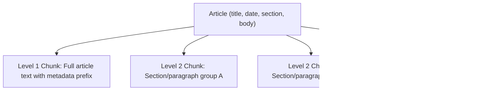
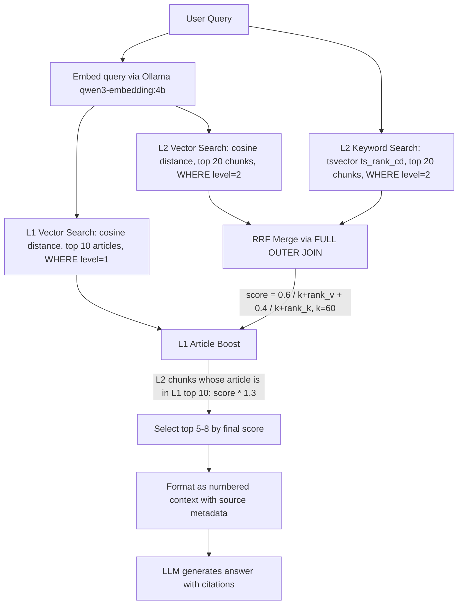

# ADR-0006: Embedding Model & Hierarchical Chunking Strategy

> **Status**: Accepted (supersedes embedding parts of original AGENTS.md)
> **Date**: 2026-06-24
> **Deciders**: Alan, Agent
> **Scope**: Embedding pipeline, chunking, retrieval, database schema

---

## Context and Problem Statement

Two related decisions need to be made together because the chunking strategy depends on the embedding model's capabilities:

1. **Embedding model**: The original plan used SiliconFlow BGE-M3 (remote API, 1024 dims). We want to switch to `qwen3-embedding:4b` running locally via Ollama for full control, no API dependency, and better multilingual performance.

2. **Chunking strategy**: The original plan used flat 600-900 char chunks with overlap. But the site's article characteristics suggest a better approach:

**Site article characteristics:**
- Most articles are short: ~500-2000 Chinese characters
- Clear structure: title, date, section, body
- Many articles fit in a single chunk entirely
- Mixed Chinese/English (technical terms, names, conference titles)
- 5 distinct columns with different content types

A flat chunking approach loses the article-level relationship and over-fragments short articles.

## Decision Drivers

- Articles are short enough that many fit in one chunk (500-2000 chars)
- Need article-level retrieval for citations (return whole article context)
- Need fine-grained retrieval for long articles with multiple topics
- `qwen3-embedding:4b` has 40K context window, supports custom dims (32-4096)
- Local Ollama eliminates API rate limits and China firewall issues
- Multilingual capability (100+ languages) for English query on Chinese content

## Blast Radius

### Database Schema Change

The `chunks` table needs a `level` column to distinguish Level 1 (article) from Level 2 (section) chunks. The `embedding` column dimension changes from 1024 to a new value (1024 or 2048).

**This requires re-ingestion of ALL data.** Existing embeddings from BGE-M3 are incompatible with qwen3-embedding vectors.

### Files Affected

| File | Impact | Change |
|------|--------|--------|
| `apps/web/lib/embeddings.ts` | Direct | Switch from OpenAI client to Ollama client |
| `apps/web/lib/chunking.ts` | Direct | Rewrite: hierarchical Level 1 + Level 2 strategy |
| `apps/web/lib/retrieval.ts` | Direct | Rewrite: two-level retrieval with article-first logic |
| `apps/web/entities/chunk.entity.ts` | Direct | Add `level` column, change vector dimension |
| `apps/web/migrations/` | Direct | New migration for schema changes |
| `scripts/ingest.ts` | Direct | Two-level chunk generation + embedding |
| `.env.example` | Direct | Remove SiliconFlow vars, add Ollama vars |
| `AGENTS.md` | Direct | Update tech stack table |

## Considered Options

### Embedding Model

| Option | Dims | Context | Multilingual | Local | Cost |
|--------|------|---------|-------------|-------|------|
| SiliconFlow BGE-M3 | 1024 | 8K | Yes | No (API) | Free but rate-limited |
| Ollama BGE-M3 | 1024 | 8K | Yes | Yes | Free |
| **Ollama qwen3-embedding:4b** | Up to 4096 | 40K | Yes (100+ langs) | Yes | Free |
| Ollama qwen3-embedding:0.6b | Up to 4096 | 32K | Yes | Yes | Free, faster |

**Chosen: qwen3-embedding:4b** — best multilingual MTEB scores in its size class, 40K context (entire articles fit), flexible dimensions, runs on M1 Pro.

### Chunking Strategy

| Option | Description | Pros | Cons |
|--------|-------------|------|------|
| Flat 600-900 char chunks | Original plan | Simple | Over-fragments short articles, loses article context |
| Per-article only | One embedding per article | Preserves article integrity | Misses fine-grained matches in long articles |
| **Hierarchical L1+L2** | L1 per-article + L2 per-section | Best of both worlds | More complex, ~2x embeddings |

**Chosen: Hierarchical Level 1 + Level 2**

## Decision Outcome

### Embedding Model: qwen3-embedding:4b via Ollama

```
Model:          qwen3-embedding:4b
Size:           2.5 GB
Context:        40K tokens
Dimensions:     1024 (chosen; range 32-4096)
Languages:      100+ including Chinese, English
Runtime:        Local Ollama (http://localhost:11434)
Hardware:       M1 Pro (sufficient for 4b model)
```

**Why 1024 dimensions** (not 2560 or 4096): This stays within pgvector's HNSW limit while preserving a strong quality/performance balance for the bilingual corpus. It also keeps the ANN index path available without extra schema or query complexity.

### Chunking Strategy: Hierarchical Two-Level



#### Level 1: Article-Level Chunks

- **One chunk per article**
- Content: metadata prefix + full article body (truncated at ~2000 chars if very long)
- Purpose: article-level semantic matching, used for citation retrieval
- Format:
  ```
  标题：{title}
  日期：{date}
  栏目：{section}
  正文：
  {full_body_text or first ~2000 chars}
  ```

#### Level 2: Section-Level Chunks (for articles > 800 chars)

- **Multiple chunks per article** (only for articles that are long enough to split)
- Split strategy:
  1. Split on double newlines (paragraph boundaries) first
  2. Merge adjacent paragraphs until ~600-900 chars
  3. Overlap: ~100 chars between adjacent L2 chunks
- Content: metadata prefix + chunk text
- Purpose: fine-grained matching within long articles

#### Decision Rules

| Article Length | Level 1 | Level 2 | Rationale |
|---------------|---------|---------|-----------|
| < 800 chars | Yes (full text) | No | Article is already small enough; one chunk suffices |
| 800-2000 chars | Yes (full text) | Yes (2-3 chunks) | Article fits in L1 but benefits from granular L2 |
| > 2000 chars | Yes (first 2000 chars) | Yes (multiple chunks) | L1 captures essence; L2 chunks cover full text |

### Retrieval Strategy: Two-Level Hybrid Search

#### Index Infrastructure (pgvector + PostgreSQL)

```
HNSW Index:   idx_chunks_embedding_hnsw
  Type:       hnsw
  Operator:   vector_cosine_ops
  Params:     m = 16, ef_construction = 64
  Column:     embedding vector(1024)
  Purpose:    Fast approximate nearest neighbor for cosine distance

GIN Index:    idx_chunks_content_gin
  Type:       gin
  Expression: to_tsvector('simple', COALESCE(content_segmented, content))
  Purpose:    Fast full-text keyword matching on jieba-segmented Chinese
```

#### Distance Metric: Cosine Distance

We use **cosine distance** (`<=>` operator) throughout, not L2 or inner product.

| Metric | Operator | Index Ops Class | Why / Why Not |
|--------|----------|-----------------|---------------|
| **Cosine distance** | `<=>` | `vector_cosine_ops` | Direction-based; works well for text similarity regardless of vector magnitude. qwen3-embedding outputs are not guaranteed L2-normalized, so cosine is more robust than inner product. |
| L2 distance | `<->` | `vector_l2_ops` | Magnitude-sensitive; not ideal for comparing embeddings of different-length texts |
| Inner product | `<#>` | `vector_ip_ops` | Requires L2-normalized vectors; we don't normalize |

**Note**: Cosine distance = `1 - cosine_similarity`. Lower `<=>` value = more similar. pgvector's `<=>` returns distance (0 = identical), not similarity.

#### Confidence / Similarity Threshold

**Current design: No hard threshold.** We rely on RRF rank-based scoring rather than absolute distance cutoffs.

Rationale:
- Cosine distance values are not intuitive thresholds (varies by model, query length, content type)
- A fixed threshold (e.g., "reject if distance > 0.5") would either miss valid results or include noise
- The RRF rank-based fusion naturally pushes irrelevant results to the bottom
- The LLM system prompt handles the "not enough context" case: if retrieved chunks are irrelevant, the LLM says "I cannot find the answer"

If precision issues arise in evaluation, we can add a **post-RRF floor**: discard results below a minimum RRF score. This is easier to tune than raw cosine thresholds.

#### Reranking Decision: No Cross-Encoder Reranker

| Approach | Pros | Cons | Decision |
|----------|------|------|----------|
| **No reranker (current)** | Simpler, faster, no additional model | May miss nuanced relevance ordering | Chosen for v1 |
| Cross-encoder reranker (e.g., bge-reranker-v2) | More accurate pairwise relevance scoring | Extra model to run, adds 200-500ms latency, complex setup | Deferred to v2 if eval scores are low |
| LLM-based reranking | Uses the LLM to score relevance | Very slow, expensive, overkill | Rejected |

**Why no reranker for v1**: The site corpus is ~850 articles of mostly homogeneous structure (news, events, awards). The evaluation questions are factual and specific (dates, names, organizations). For this type of content, HNSW cosine + keyword + RRF provides sufficient retrieval quality. If the evaluation score on the 1000-question set shows retrieval is the bottleneck, we add a reranker in v2.

#### Full Scoring Pipeline



#### Scoring Constants: `.env` vs Code

Tunable constants that may change during evaluation are configurable via `.env`. Structural constants that are implementation details stay in code as named exports.

**Tunable via `.env`** (may change during evaluation):

| Env Variable | Code Constant | Default | Rationale |
|-------------|---------------|---------|-----------|
| `RETRIEVAL_VECTOR_WEIGHT` | `VECTOR_WEIGHT` | `0.6` | A/B test vector vs keyword balance |
| `RETRIEVAL_KEYWORD_WEIGHT` | `KEYWORD_WEIGHT` | `0.4` | Derived from vector weight |
| `RETRIEVAL_TOP_K` | `FINAL_TOP_K` | `8` | 5 vs 8 chunks affects answer quality vs token usage |
| `RETRIEVAL_L1_BOOST` | `L1_BOOST_FACTOR` | `1.3` | New mechanism, needs experimentation |

**Structural in code** (rarely change, would confuse as env vars):

| Code Constant | Value | Rationale |
|---------------|-------|-----------|
| `RRF_K` | `60` | Mathematical constant from the RRF paper; changing it without understanding the math breaks scoring |
| `L1_TOP_K` | `10` | Internal pipeline limit for L1 search |
| `L2_VECTOR_TOP_K` | `20` | Internal pipeline limit for L2 vector arm |
| `L2_KEYWORD_TOP_K` | `20` | Internal pipeline limit for L2 keyword arm |

All constants MUST be named exports — no magic numbers inline.

```typescript
// Code pattern:
export const VECTOR_WEIGHT = parseFloat(process.env.RETRIEVAL_VECTOR_WEIGHT ?? "0.6");
export const KEYWORD_WEIGHT = parseFloat(process.env.RETRIEVAL_KEYWORD_WEIGHT ?? "0.4");
export const FINAL_TOP_K = parseInt(process.env.RETRIEVAL_TOP_K ?? "8", 10);
export const L1_BOOST_FACTOR = parseFloat(process.env.RETRIEVAL_L1_BOOST ?? "1.3");

// Structural constants — named exports, not env vars
export const RRF_K = 60;
export const L1_TOP_K = 10;
export const L2_VECTOR_TOP_K = 20;
export const L2_KEYWORD_TOP_K = 20;
```

#### RRF Formula (per L2 chunk)

```
base_score = VECTOR_WEIGHT * (1 / (RRF_K + vector_rank))     -- 0 if not in vector results
           + KEYWORD_WEIGHT * (1 / (RRF_K + keyword_rank))   -- 0 if not in keyword results

final_score = base_score * L1_BOOST_FACTOR   -- if chunk's article_id is in L1 top 10
            | base_score                      -- otherwise
```

A chunk appearing in **both** vector and keyword results gets a combined score from both arms. A chunk in only one arm gets 0 from the other. The FULL OUTER JOIN ensures no results are dropped.

**Key insight**: The L1 boost acts as a soft reranker. Instead of an expensive cross-encoder, we use article-level semantic similarity as a proxy for relevance. If the article as a whole matches the query, its sections are more likely to be relevant.

### Anti-Patterns to Avoid

| Anti-Pattern | Why | Correct Approach |
|-------------|-----|-----------------|
| Only flat chunking | Over-fragments 500-char articles into useless snippets | Hierarchical: short articles stay as single L1 chunk |
| Only article-level chunks | Misses fine-grained matches in 2000+ char articles | L2 chunks for section-level matching |
| Using remote embedding API for ingestion | Slow, rate-limited, blocked from Beijing server | Local Ollama, no API dependency |
| Embedding dimension > 1024 without benchmarking | Larger dims increase index size and query latency | Start at 1024, benchmark, increase only if needed |
| Re-embedding on every ingest run | Wastes compute for unchanged articles | Skip articles with existing chunks+embeddings |
| Late chunking without clear article structure | Complex, hard to debug | Explicit hierarchical chunking with clear levels |
| Magic numbers (`if (level === 1)`, `limit 8`) | Unreadable, error-prone, violates DRY | Use `const enum ChunkLevel { Article = 1, Section = 2 }` and named constants |
| Hardcoded tunable values in code | Can't adjust during evaluation without rebuild | Tunable values via `process.env` with typed defaults |
| Duplicated type definitions across files | DRY violation, divergence risk | Centralize shared types (e.g., `RetrievalResult`, `Citation`) in a single types file |

### Shared Enums and Constants

All domain enums and tunable constants live in a central location so every module imports from one source of truth:

```typescript
// apps/web/lib/constants.ts

/** Chunk levels for hierarchical retrieval */
export const enum ChunkLevel {
  /** Full article text with metadata — one per article */
  Article = 1,
  /** Section/paragraph group within a long article */
  Section = 2,
}

/** Chat message roles */
export const enum MessageRole {
  User = "user",
  Assistant = "assistant",
}

// --- Tunable via .env (may change during evaluation) ---
export const VECTOR_WEIGHT = parseFloat(process.env.RETRIEVAL_VECTOR_WEIGHT ?? "0.6");
export const KEYWORD_WEIGHT = parseFloat(process.env.RETRIEVAL_KEYWORD_WEIGHT ?? "0.4");
export const FINAL_TOP_K = parseInt(process.env.RETRIEVAL_TOP_K ?? "8", 10);
export const L1_BOOST_FACTOR = parseFloat(process.env.RETRIEVAL_L1_BOOST ?? "1.3");
export const EMBEDDING_DIMENSIONS = parseInt(process.env.EMBEDDING_DIMENSIONS ?? "1024", 10);

// --- Structural constants (implementation details, not user-configurable) ---
export const RRF_K = 60;
export const L1_TOP_K = 10;
export const L2_VECTOR_TOP_K = 20;
export const L2_KEYWORD_TOP_K = 20;
export const EMBEDDING_BATCH_SIZE = 32;
export const L1_TRUNCATION_CHARS = 2000;
export const L2_MIN_ARTICLE_CHARS = 800;
export const L2_TARGET_CHUNK_CHARS = 750;
export const L2_MAX_CHUNK_CHARS = 900;
export const L2_OVERLAP_CHARS = 100;
```

### Chunk Entity Schema Change

```typescript
import { ChunkLevel } from "@/lib/constants";

@Entity("chunks")
class Chunk {
  @PrimaryGeneratedColumn()
  id: number;

  @Column({ name: "article_id" })
  articleId: number;

  @Column({ name: "chunk_index" })
  chunkIndex: number;

  @Column({ type: "smallint", default: ChunkLevel.Article })
  level: ChunkLevel;  // NEW: Article (1) or Section (2)

  @Column({ type: "text" })
  content: string;

  @Column({ type: "text", nullable: true, name: "content_segmented" })
  contentSegmented: string;

  @Column({ type: "vector", length: 1024, nullable: true })
  embedding: number[] | null;

  @Column({ type: "int", nullable: true, name: "token_count" })
  tokenCount: number;
}
```

### Environment Variables Change

```env
# REMOVED (no longer needed)
# EMBEDDING_API_KEY=sk-xxx
# EMBEDDING_BASE_URL=https://api.siliconflow.cn/v1
# EMBEDDING_MODEL=BAAI/bge-m3

# NEW
OLLAMA_BASE_URL=http://localhost:11434
EMBEDDING_MODEL=qwen3-embedding:4b
EMBEDDING_DIMENSIONS=1024
```

## Consequences

### Positive
- No external API dependency for embeddings (fully local)
- No rate limits, no API costs, no China firewall issues
- 40K context window means entire articles embed without truncation
- Hierarchical chunking preserves article integrity for short articles
- L1+L2 retrieval gives both broad (article) and narrow (section) matching
- qwen3-embedding:4b has strong multilingual MTEB scores

### Negative
- **Full re-ingestion required** (all existing embeddings are from BGE-M3, incompatible)
- ~2x more embeddings to store (L1 + L2 vs flat L2 only)
- Slightly more complex retrieval logic (two-level search + boosting)
- 2.5 GB model must be available locally (not an issue for M1 Pro)

### Neutral
- Embedding dimension stays at 1024 (same as before), so HNSW index config unchanged
- Migration adds `level` column with default 1 (backward compatible for existing data, but re-ingest is still needed for new model)

## Confirmation

- [ ] `ollama pull qwen3-embedding:4b` succeeds locally
- [ ] Embedding output is 1024 dimensions
- [ ] Hierarchical chunking produces correct L1 and L2 chunks for test articles
- [ ] L1 chunk count matches article count
- [ ] L2 chunks only exist for articles > 800 chars
- [ ] Retrieval returns results for both Chinese and English queries
- [ ] Full re-ingest completes without errors
