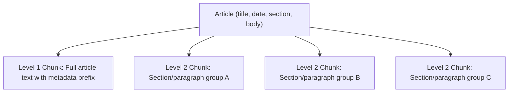
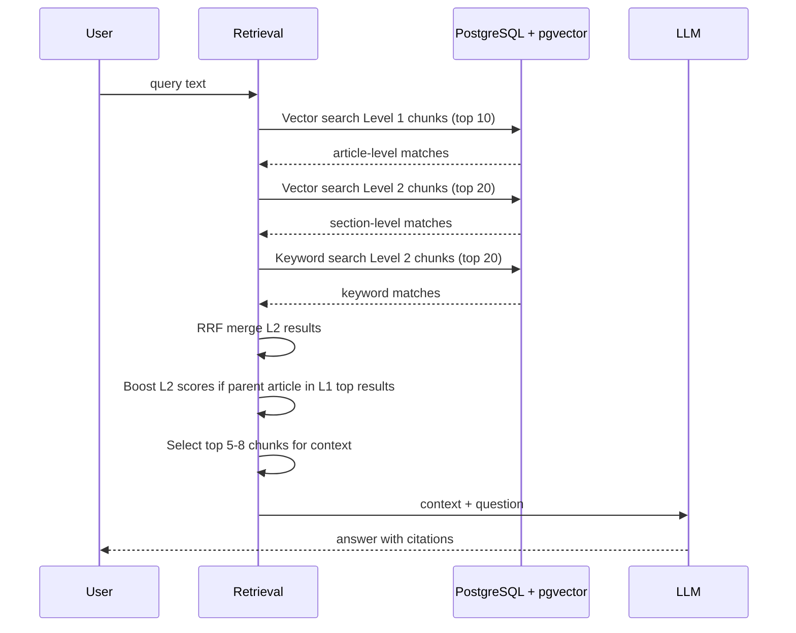

# ADR-0006: Embedding Model & Hierarchical Chunking Strategy

> **Status**: Accepted (supersedes embedding parts of original AGENTS.md)
> **Date**: 2026-06-24
> **Deciders**: Alan, Agent
> **Scope**: Embedding pipeline, chunking, retrieval, database schema

---

## Context and Problem Statement

Two related decisions need to be made together because the chunking strategy depends on the embedding model's capabilities:

1. **Embedding model**: The original plan used SiliconFlow BGE-M3 (remote API, 1024 dims). We want to switch to `qwen3-embedding:4b` running locally via Ollama for full control, no API dependency, and better multilingual performance.

2. **Chunking strategy**: The original plan used flat 600-900 char chunks with overlap. But the site's article characteristics suggest a better approach:

**Site article characteristics:**
- Most articles are short: ~500-2000 Chinese characters
- Clear structure: title, date, section, body
- Many articles fit in a single chunk entirely
- Mixed Chinese/English (technical terms, names, conference titles)
- 5 distinct columns with different content types

A flat chunking approach loses the article-level relationship and over-fragments short articles.

## Decision Drivers

- Articles are short enough that many fit in one chunk (500-2000 chars)
- Need article-level retrieval for citations (return whole article context)
- Need fine-grained retrieval for long articles with multiple topics
- `qwen3-embedding:4b` has 40K context window, supports custom dims (32-4096)
- Local Ollama eliminates API rate limits and China firewall issues
- Multilingual capability (100+ languages) for English query on Chinese content

## Blast Radius

### Database Schema Change

The `chunks` table needs a `level` column to distinguish Level 1 (article) from Level 2 (section) chunks. The `embedding` column dimension changes from 1024 to a new value (1024 or 2048).

**This requires re-ingestion of ALL data.** Existing embeddings from BGE-M3 are incompatible with qwen3-embedding vectors.

### Files Affected

| File | Impact | Change |
|------|--------|--------|
| `apps/web/lib/embeddings.ts` | Direct | Switch from OpenAI client to Ollama client |
| `apps/web/lib/chunking.ts` | Direct | Rewrite: hierarchical Level 1 + Level 2 strategy |
| `apps/web/lib/retrieval.ts` | Direct | Rewrite: two-level retrieval with article-first logic |
| `apps/web/entities/chunk.entity.ts` | Direct | Add `level` column, change vector dimension |
| `apps/web/migrations/` | Direct | New migration for schema changes |
| `scripts/ingest.ts` | Direct | Two-level chunk generation + embedding |
| `.env.example` | Direct | Remove SiliconFlow vars, add Ollama vars |
| `AGENTS.md` | Direct | Update tech stack table |

## Considered Options

### Embedding Model

| Option | Dims | Context | Multilingual | Local | Cost |
|--------|------|---------|-------------|-------|------|
| SiliconFlow BGE-M3 | 1024 | 8K | Yes | No (API) | Free but rate-limited |
| Ollama BGE-M3 | 1024 | 8K | Yes | Yes | Free |
| **Ollama qwen3-embedding:4b** | Up to 4096 | 40K | Yes (100+ langs) | Yes | Free |
| Ollama qwen3-embedding:0.6b | Up to 4096 | 32K | Yes | Yes | Free, faster |

**Chosen: qwen3-embedding:4b** — best multilingual MTEB scores in its size class, 40K context (entire articles fit), flexible dimensions, runs on M1 Pro.

### Chunking Strategy

| Option | Description | Pros | Cons |
|--------|-------------|------|------|
| Flat 600-900 char chunks | Original plan | Simple | Over-fragments short articles, loses article context |
| Per-article only | One embedding per article | Preserves article integrity | Misses fine-grained matches in long articles |
| **Hierarchical L1+L2** | L1 per-article + L2 per-section | Best of both worlds | More complex, ~2x embeddings |

**Chosen: Hierarchical Level 1 + Level 2**

## Decision Outcome

### Embedding Model: qwen3-embedding:4b via Ollama

```
Model:          qwen3-embedding:4b
Size:           2.5 GB
Context:        40K tokens
Dimensions:     1024 (chosen; range 32-4096)
Languages:      100+ including Chinese, English
Runtime:        Local Ollama (http://localhost:11434)
Hardware:       M1 Pro (sufficient for 4b model)
```

**Why 1024 dimensions** (not 2048 or 4096): Good balance of quality and performance. HNSW index size and query latency grow with dimensions. 1024 is the same as the current schema, minimizing migration complexity. Can increase later if retrieval quality is insufficient.

### Chunking Strategy: Hierarchical Two-Level



#### Level 1: Article-Level Chunks

- **One chunk per article**
- Content: metadata prefix + full article body (truncated at ~2000 chars if very long)
- Purpose: article-level semantic matching, used for citation retrieval
- Format:
  ```
  标题：{title}
  日期：{date}
  栏目：{section}
  正文：
  {full_body_text or first ~2000 chars}
  ```

#### Level 2: Section-Level Chunks (for articles > 800 chars)

- **Multiple chunks per article** (only for articles that are long enough to split)
- Split strategy:
  1. Split on double newlines (paragraph boundaries) first
  2. Merge adjacent paragraphs until ~600-900 chars
  3. Overlap: ~100 chars between adjacent L2 chunks
- Content: metadata prefix + chunk text
- Purpose: fine-grained matching within long articles

#### Decision Rules

| Article Length | Level 1 | Level 2 | Rationale |
|---------------|---------|---------|-----------|
| < 800 chars | Yes (full text) | No | Article is already small enough; one chunk suffices |
| 800-2000 chars | Yes (full text) | Yes (2-3 chunks) | Article fits in L1 but benefits from granular L2 |
| > 2000 chars | Yes (first 2000 chars) | Yes (multiple chunks) | L1 captures essence; L2 chunks cover full text |

### Retrieval Strategy: Two-Level Search



**Key insight**: If an article matches at Level 1 (semantically similar as a whole), its Level 2 chunks get a score boost in the RRF merge. This ensures that relevant articles surface their specific passages.

### Anti-Patterns to Avoid

| Anti-Pattern | Why | Correct Approach |
|-------------|-----|-----------------|
| Only flat chunking | Over-fragments 500-char articles into useless snippets | Hierarchical: short articles stay as single L1 chunk |
| Only article-level chunks | Misses fine-grained matches in 2000+ char articles | L2 chunks for section-level matching |
| Using remote embedding API for ingestion | Slow, rate-limited, blocked from Beijing server | Local Ollama, no API dependency |
| Embedding dimension > 1024 without benchmarking | Larger dims increase index size and query latency | Start at 1024, benchmark, increase only if needed |
| Re-embedding on every ingest run | Wastes compute for unchanged articles | Skip articles with existing chunks+embeddings |
| Late chunking without clear article structure | Complex, hard to debug | Explicit hierarchical chunking with clear levels |

### Chunk Entity Schema Change

```typescript
// Updated chunk entity
@Entity("chunks")
class Chunk {
  @PrimaryGeneratedColumn()
  id: number;

  @Column({ name: "article_id" })
  articleId: number;

  @Column({ name: "chunk_index" })
  chunkIndex: number;

  @Column({ type: "smallint", default: 1 })
  level: 1 | 2;  // NEW: 1 = article-level, 2 = section-level

  @Column({ type: "text" })
  content: string;

  @Column({ type: "text", nullable: true, name: "content_segmented" })
  contentSegmented: string;

  @Column({ type: "float", array: true, nullable: true })
  embedding: number[];  // vector(1024) via pgvector

  @Column({ type: "int", nullable: true, name: "token_count" })
  tokenCount: number;
}
```

### Environment Variables Change

```env
# REMOVED (no longer needed)
# EMBEDDING_API_KEY=sk-xxx
# EMBEDDING_BASE_URL=https://api.siliconflow.cn/v1
# EMBEDDING_MODEL=BAAI/bge-m3

# NEW
OLLAMA_BASE_URL=http://localhost:11434
EMBEDDING_MODEL=qwen3-embedding:4b
EMBEDDING_DIMENSIONS=1024
```

## Consequences

### Positive
- No external API dependency for embeddings (fully local)
- No rate limits, no API costs, no China firewall issues
- 40K context window means entire articles embed without truncation
- Hierarchical chunking preserves article integrity for short articles
- L1+L2 retrieval gives both broad (article) and narrow (section) matching
- qwen3-embedding:4b has strong multilingual MTEB scores

### Negative
- **Full re-ingestion required** (all existing embeddings are from BGE-M3, incompatible)
- ~2x more embeddings to store (L1 + L2 vs flat L2 only)
- Slightly more complex retrieval logic (two-level search + boosting)
- 2.5 GB model must be available locally (not an issue for M1 Pro)

### Neutral
- Embedding dimension stays at 1024 (same as before), so HNSW index config unchanged
- Migration adds `level` column with default 1 (backward compatible for existing data, but re-ingest is still needed for new model)

## Confirmation

- [ ] `ollama pull qwen3-embedding:4b` succeeds locally
- [ ] Embedding output is 1024 dimensions
- [ ] Hierarchical chunking produces correct L1 and L2 chunks for test articles
- [ ] L1 chunk count matches article count
- [ ] L2 chunks only exist for articles > 800 chars
- [ ] Retrieval returns results for both Chinese and English queries
- [ ] Full re-ingest completes without errors
