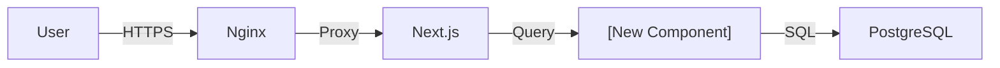
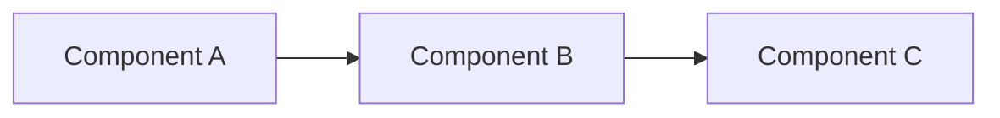
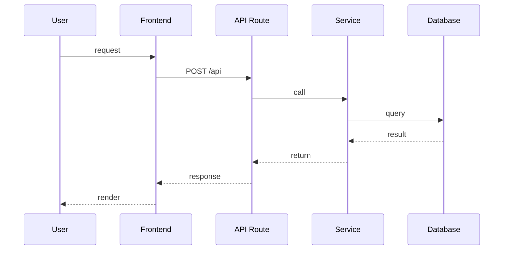
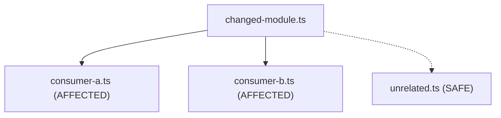

# Phase 2: Technical Design — [Feature Title]

> **Status**: DESIGN
> **Proposal**: [link to 01-proposal.md]
> **Author**: [name / agent]
> **Date**: YYYY-MM-DD
> **Feature ID**: FEAT-XXX

---

## 1. Architecture Overview

_High-level description of how this feature fits into the existing system._

### System Context Diagram



### Component Diagram



## 2. Data Specification

### New Entities / Schema Changes

```typescript
// Example entity definition
interface NewEntity {
  id: string;
  // ...fields with types
}
```

### Database Migration

```sql
-- Migration SQL (if applicable)
```

### API Contracts

#### Endpoint: `METHOD /api/path`

**Request:**
```json
{
  "field": "type — description"
}
```

**Response:**
```json
{
  "field": "type — description"
}
```

**Error Responses:**

| Status | Code | Description |
|--------|------|-------------|
| 400 | INVALID_INPUT | |
| 401 | UNAUTHORIZED | |
| 500 | INTERNAL_ERROR | |

## 3. Sequence Diagram



## 4. File Changes

| File | Action | Description |
|------|--------|-------------|
| `apps/web/lib/new-module.ts` | CREATE | |
| `apps/web/app/api/new/route.ts` | CREATE | |
| `apps/web/entities/new.entity.ts` | CREATE | |
| `apps/web/lib/existing.ts` | MODIFY | |

## 5. Dependencies

### Internal Dependencies

- Which existing modules does this feature depend on?

### External Dependencies (new packages)

| Package | Version | Purpose | Size Impact |
|---------|---------|---------|-------------|
| | | | |

## 6. Testing Strategy (TDD)

Tests are written BEFORE implementation. Follow Red-Green-Refactor.

### Test Plan

| AC ID | Test File | Test Description | Type |
|-------|-----------|------------------|------|
| AC-1 | `__tests__/feature.test.ts` | | Unit |
| AC-2 | `__tests__/feature.integration.test.ts` | | Integration |
| AC-3 | `e2e/feature.spec.ts` | | E2E |

### Test Infrastructure Needed

- [ ] Mock setup for external APIs
- [ ] Test database fixtures
- [ ] Test helpers / utilities

## 7. Blast Radius Analysis

_Technical analysis of what this change touches and what could break._

### Dependency Graph



### Migration Safety

- **Backward compatible?** Yes / No
- **Downtime required?** None / Brief / Extended
- **Data re-processing needed?** None / Partial / Full re-ingest

## 8. Anti-Patterns & Guardrails

_Technical anti-patterns to avoid during implementation._

| Anti-Pattern | Detection Method | Guardrail |
|-------------|-----------------|-----------|
| | Code review / Lint rule / Test | |

## 9. Security Design

_Detailed security implementation for this feature._

### Input Validation

| Input | Validation | Sanitization |
|-------|-----------|-------------|
| | | |

### Data Protection

- **Secrets handling**: How are API keys / credentials managed?
- **Data exposure**: What data is exposed to the client?
- **Injection prevention**: SQL / XSS / Command injection mitigations

## 10. Performance Considerations

_Any performance implications? Query complexity? Payload sizes?_

## 11. Rollback Plan

_How do we undo this if it fails in production?_

---

## Sign-off

- [ ] Architecture reviewed
- [ ] Data spec agreed
- [ ] Test plan covers all ACs
- [ ] Ready for Phase 3 (Tasks)
